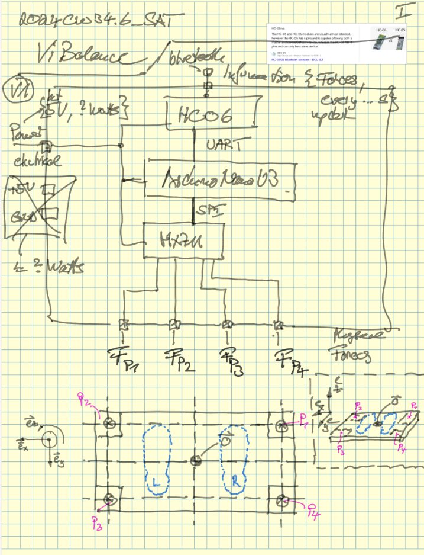
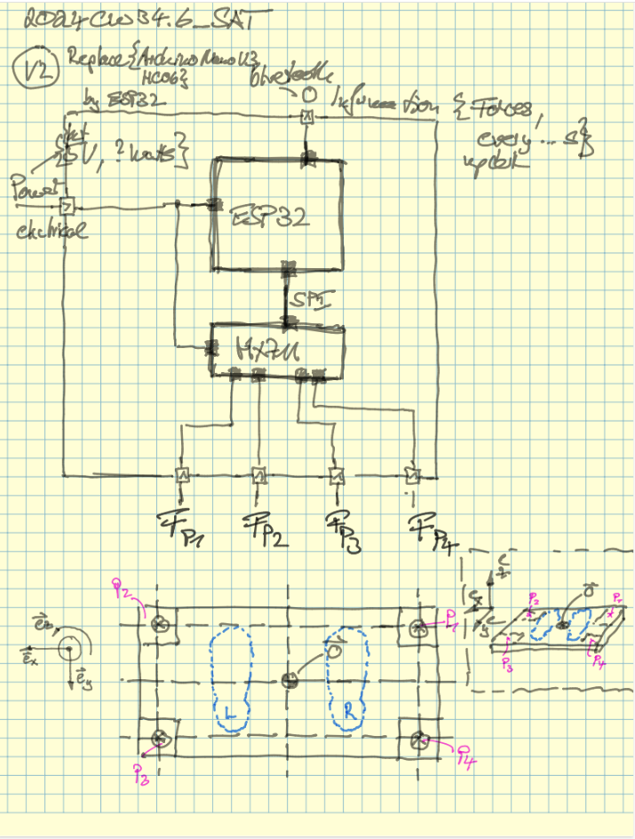

.. post:: 2024-08-19
    :tags: Wii, Balance Board, HX711, Load Cell, Raspberry Pi, ESP32, FARM-Stack, React, Redux, MongoDB, FastAPI, MongoDB,  OpenAPI, Kiota 
    :language: English

Mini-Project: MePosture
#######################

**Let's tinker a gadget!**

- Time estimate: One afternoon
- Cost estimate: Far below 50 Euro (Raspberry Pi and Monitor not included)
- Skill level: Intermediate hobby tinkerer

WIP - Work-In-Progress!

Background
**********

Recently I met a physician in the field of orthopaedics, sports medicine and performance diagnostics. I learned from him that a good posture is important for our health and well-being.

The Gadget
**********

With a ...

- **home-made Balance Board** (like a Wii Balance Board) with hardware used in digital scales, voltage amplifiers (HX711) and a microcontroller with built-in Bluetooth (ESP32-WROOM)
- **WebApp** (Full-Stack with FARM-Stack: FastAPI, React, MongoDB) to visualize the data and to provide a user interface for the user to interact with the gadget. In the DataBase historical health data can be stored and analyzed.

Resources
*********

Just the links to the resources and some notes here.

- `HX711 with a Four Wire Load Cell and Arduino | Step by Step Guide. <https://www.youtube.com/watch?v=sxzoAGf1kOo>`__
- `HX711 library on GitHub <https://github.com/olkal/HX711_ADC>`__
- `Load Cell Mounts on Thingiverse <https://www.thingiverse.com/tag:load_cell>`__
- `Arduino Scale with HX711 and 50kg Bathroom Scale Load Cells | Step by Step Guide. <https://youtu.be/LIuf2egMioA?si=nJ9Kk_18cXRv12_j>`__
- `Raspberry Pi Smart Scale | GIT TECH'D <https://youtu.be/8gj2D52B9n8?si=6VU6kN4OZjCL1gsv>`__
- `Mounting the 50kg Bathroom Scale Load Cells to a Board <https://www.youtube.com/watch?v=aTn74FyhrXI>`__
- `how to connect Wii Balance Board to Windows in 2024 <https://youtu.be/crKoQWvGRok?si=7Ke7KE0Y-2OWVQpg>`__
- `Ebay: Digital Scale Set (4x Load Cell, 1x Amplifier) <https://www.ebay.de/itm/234796576410?_trkparms=amclksrc%3DITM%26aid%3D1110006%26algo%3DHOMESPLICE.SIM%26ao%3D1%26asc%3D20200818143230%26meid%3Db5a09e7cc4f748fc8f013a86210382b7%26pid%3D101224%26rk%3D4%26rkt%3D5%26sd%3D386339206392%26itm%3D234796576410%26pmt%3D1%26noa%3D1%26pg%3D4429486%26algv%3DDefaultOrganicWebV9BertRefreshRankerWithCassiniEmbRecall%26brand%3DMarkenlos&_trksid=p4429486.c101224.m-1>`__
- `Ebay: Amplifier <https://www.ebay.de/itm/293840537869?_nkw=HX711&itmmeta=01J5MQ8NQHS3Y0ZFJKER1DWYD7&hash=item446a42c90d:g:PgYAAOSwkH5kLTdk&itmprp=enc%3AAQAJAAAA4HoV3kP08IDx%2BKZ9MfhVJKlUkfHyxwr%2BcpjnFHyV18f%2FXZVUImoDurlDUvWO7FGWzAvbALLgRSUeKFzUiAI1BU23DXZelMUpHoeSfk3Jc6RdHAFSf6rsXMGCfvNVir3ITwbpHFq0f4JaV1lmQOztEQfbx6%2B22gKCoyXXevfquYPC4Z5Invd6KXuPmhFXapL84s9R2ub3JXgjbuU1m9GApfa6P6a8gqTIUPOrSPDnNK%2BaF%2Br3cLpOva0R5QmUomA9cDOUuEDB1rq%2FbqetKhF8VQbN%2B5e5s87Ztk5DtmhsX5Z4%7Ctkp%3ABFBM9tuil61k>`__

Sketches
********

Here some sketches:

Expert Dialogs
**************

Here some GPT-4o chats:

.. toctree::
    :maxdepth: 1
    :caption: Related GPT-4o chats

    _attachments/ChatGPT-ESP32_HX711_Bluetooth_Project.rst
    _attachments/ChatGPT-ESP32_Load_Cell_Integration.rst
    _attachments/ChatGPT-HX711_Circuit_Function.rst
    _attachments/ChatGPT-Using_Wii_BalanceBoard_Raspberry_Pi.rst

