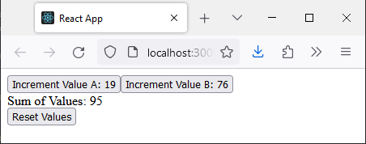

.. post:: 2024-08-01
    :tags: React, Redux, Software Architecture, Extensibility, Modularity
    :language: English

Design Study - React+Redux the Extensible Way
#############################################

With this article I try to create an extensible version of a Web Application based on React and Redux.

To do so I create first a small example with a few requirements. Those requirements shall be satisfied step by step according the release roadmap.

The sources are also available in the repository `your-app-name <https://github.com/basejumpa/your-app-name>`_. The commit history reflects rougly the release roadmap.

.. contents:: Table of Contents
    :local:
    :depth: 2

Requirements
************

Req_01:
    The user shall be able to interact with the app by entering values and getting calculated values derived from their inputs.

Req_02:
    The app shall have a button. When the user presses this button a value is incremented. The button label shows that value. Initial value is 19.

Req_03:
    The app shall have a second button. When pressed it retrieves a value from an API call and adds it to its own value which is displayed in the button label. Initial state of the own variable is 76.

Req_04:
    The app shall display the sum of the values of ComponentA und ComponentB.

Req_05:
    The app shall provide a button to reset the variables to their initial ones.

Release Roadmap
***************

Releases and the Requirements to satisfy::

        Rel_1           Rel_2       Rel_3       Rel_4
    ---|---------------|-----------|-----------|--------->

        Req_01          Req_01      Req_01      Req_01
        Req_02          Req_02      Req_02      Req_02
                        Req_03      Req_03      Req_03
                                    Req_04      Req_04
                                                Req_05

Architectural Design
********************

Concept
============

The application is built using a modular architecture that allows for easy extension and maintenance. Each component manages its own state and reducers, which are dynamically registered to the store. This approach ensures that the application can scale easily as new features are added.

.. _fig_slices:

.. drawio-figure:: _figures/swad_concept.drawio

    Components contribute slices to the store

Building Block View
===================

We emphasize modularity and extensibility. Each component manages its own state and reducers, which are dynamically registered to the store. This allows the application to scale easily as new features are added.

.. _fig_bd_building_blocks:

.. drawio-figure:: _figures/bd_swad_building_blocks.drawio

    Building Block View

.. todo:: Add description of interfaces between blocks

Runtime View
============

.. todo:: Add runtime view

    Sequence Diagrams for the "good" and "bad" scenarios

    "Good" scenarios:

    - «event» Frontend (re)-load
    - «event» Backend start
    - «event» click on 1st button
    - «event» click on 2nd button

    "Bad" scenarios:

    - «event» click on 2nd button while API is down

Scenario «event» Frontend (re)-load
-----------------------------------

.. uml:: _figures/sd_swad_frontend_load.uml
    :caption: Frontend (re)-load

.. todo:: Finish Scenario «event» Frontend (re)-load

Design Alternatives Considered
==============================

1. **Single Store File**: Initially, we considered managing all reducers in a single `store/index.js` file. However, this approach is not scalable as it requires modifying the store file every time a new reducer is added, leading to tight coupling and reduced maintainability.

2. **Manual Reducer Registration**: Another approach was to manually register reducers in the `store/index.js` file. This was rejected because it hinders extensibility. Instead, we opted for a dynamic registration mechanism that allows each component to register its own reducer.

3. **Hardcoded Reducers**: Hardcoding reducers in the main store configuration was also considered but discarded due to the lack of flexibility. Dynamic registration provides better modularity and allows for lazy loading of reducers.

Traceability Reqs to Architectural Elements
===========================================

::

    Req_01  is satisfied by   App, Store
    Req_02  is satisfied by   ComponentA
    Req_03  is satisfied by   ComponentB, Backend
    Req_04  is satisfied by   ComponentC
    Req_05  is satisfied by   ComponentD

::

    Component            Req01  Req02  Req03  Req04  Req05
    =========================================================
    Core ----------------------------------------------------
    App                   X     (x)    (x)    (X)    (x)
    Store                 X
    Backend                             X
    Extensions ----------------------------------------------
        ComponentA        X      X
        ComponentB        X             X
        ComponentC        X                    X
        ComponentD        X                           X
    ----------------------------------------------------------

    |  X   : Component is responsible to satisfy requirement.
    | (x)  : Component needs minor modifications to satisfy requirement

Detailed Design & Construction
******************************

Directory structure
===================

::

    -- FRONTEND ---------------------------
    /src
        App.js
        index.js
        /store
            reducerManager.js
            store.js
        /components
            /ComponentsA
                index.js
                slice.js
            /ComponentsB
                index.js
                slice.js
            /ComponentsC
                index.js
                slice.js
            /ComponentsD
                index.js
                slice.js
    ---------------------------------------

    -- BACKEND ----------------------------
    /backend
        __init__.py
        api.py
        app.py
        models.py
    ---------------------------------------

External Dependencies
=====================

Create Skeleton of React Application (creates external dependencies)::

    npx create-react-app your-app-name
    cd your-app-name

Install packages (adds additional external dependencies)::

    npm install \
        @reduxjs/toolkit \
        react-redux \
        redux-thunk \
        redux-logger \

«component» App
===============

.. literalinclude:: _listings/src/index.js
    :language: jsx
    :linenos:
    :caption: src/index.js

.. literalinclude:: _listings/src/App.js
    :language: jsx
    :linenos:
    :caption: src/App.js

«component» Store
=================

.. literalinclude:: _listings/src/store/index.js
    :language: jsx
    :linenos:
    :caption: src/store/index.js

.. literalinclude:: _listings/src/store/reducerManager.js
    :language: jsx
    :linenos:
    :caption: src/store/reducerManager.js

Backend
=======

Create Skeleton of Python/FastAPI Application::

    poetry init \
    --name your-app-name \
    --description "Backend of The Extensible App" \
    --author "Calidus Callidus <calidus@callidus.it>" \
    --python "^3.8"
    --dependency fastapi \
    --dependency uvicorn \

File `backend/__init__.py` is empty.

«Component» App
---------------

.. literalinclude:: _listings/backend/app.py
    :language: python
    :linenos:
    :caption: backend/app.py

«component» Models
------------------

.. literalinclude:: _listings/backend/models.py
    :language: python
    :linenos:
    :caption: backend/models.py

«Component» API
---------------

.. literalinclude:: _listings/backend/api.py
    :language: python
    :linenos:
    :caption: backend/api.py

Extensions
==========

Each extension manages its own state and reducers, which are dynamically registered to the store.

«component» ComponentA
----------------------

.. literalinclude:: _listings/src/components/ComponentA/index.js
    :language: jsx
    :linenos:
    :caption: src/components/ComponentA/index.js

.. literalinclude:: _listings/src/components/ComponentA/slice.js
    :language: jsx
    :linenos:
    :caption: src/components/ComponentA/slice.js

«component» ComponentB
----------------------

.. literalinclude:: _listings/src/components/ComponentB/index.js
    :language: jsx
    :linenos:
    :caption: src/components/ComponentB/index.js

.. literalinclude:: _listings/src/components/ComponentB/slice.js
    :language: jsx
    :linenos:
    :caption: src/components/ComponentB/slice.js

«component» ComponentC
----------------------

.. literalinclude:: _listings/src/components/ComponentC/index.js
    :language: jsx
    :linenos:
    :caption: src/components/ComponentC/index.js

.. literalinclude:: _listings/src/components/ComponentC/slice.js
    :language: jsx
    :linenos:
    :caption: src/components/ComponentC/slice.js

«component» ComponentD
----------------------

.. literalinclude:: _listings/src/components/ComponentD/index.js
    :language: jsx
    :linenos:
    :caption: src/components/ComponentD/index.js

.. literalinclude:: _listings/src/components/ComponentD/slice.js
    :language: jsx
    :linenos:
    :caption: src/components/ComponentD/slice.js

User Guide
**********

Application Start
=================

Start your React application::

    # Start Backend
    poetry run python -m backend.app

    # Start Frontend
    npm start

    # Ready to go!

Usage
=====

.. todo:: Add short description on usage

Conclusion
**********

.. todo:: Add conclusion

