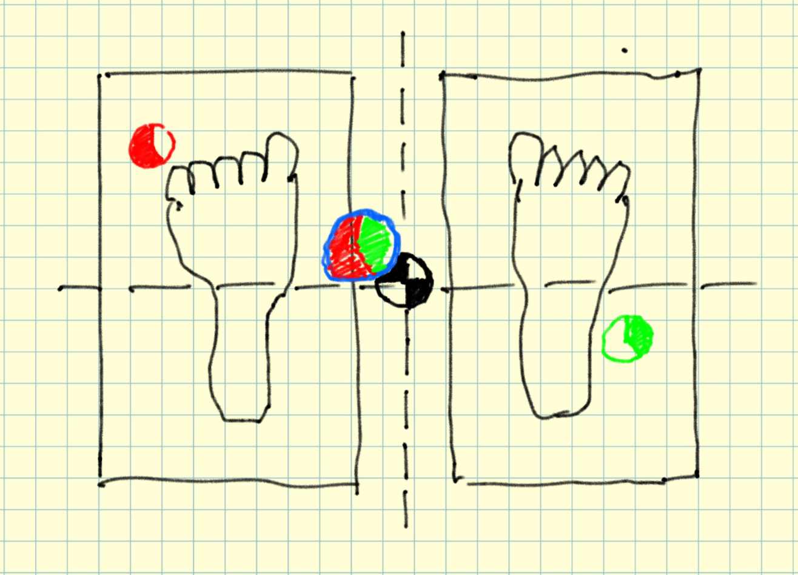
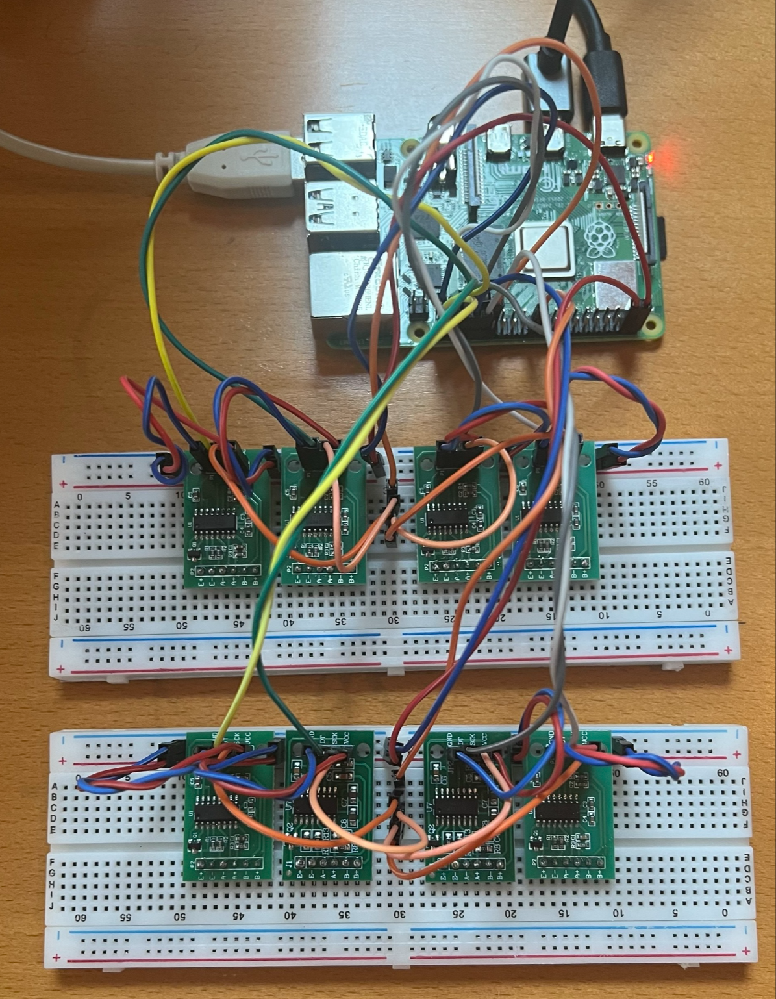
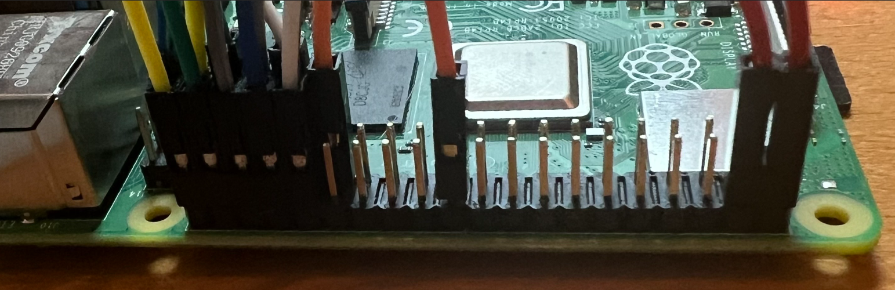
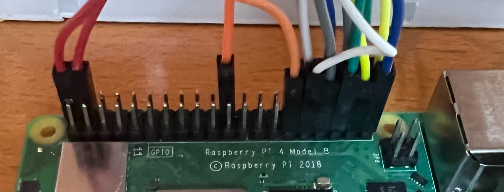
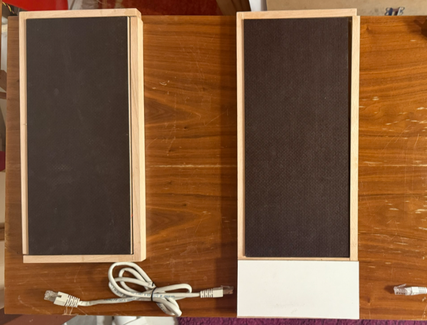
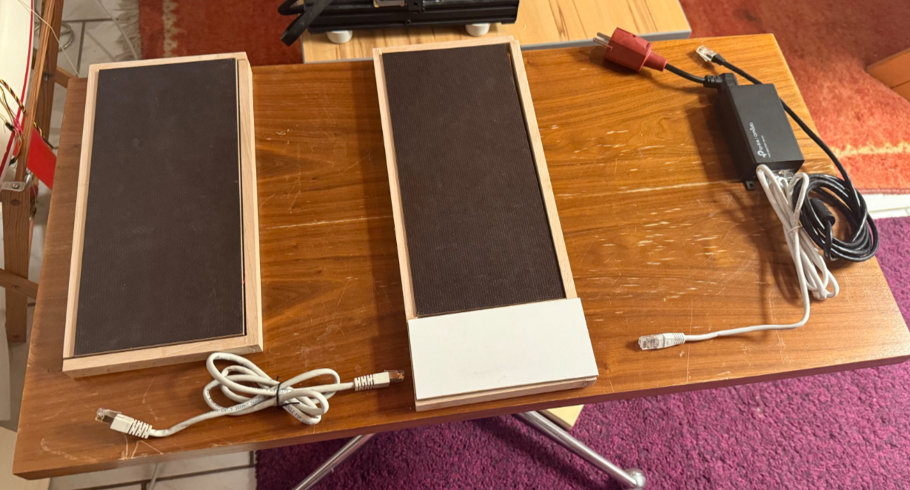
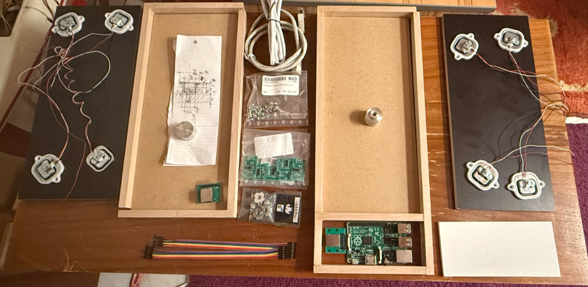
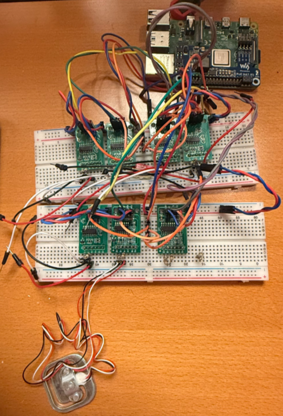
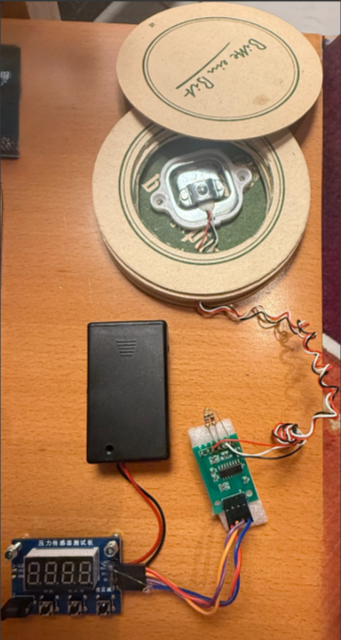
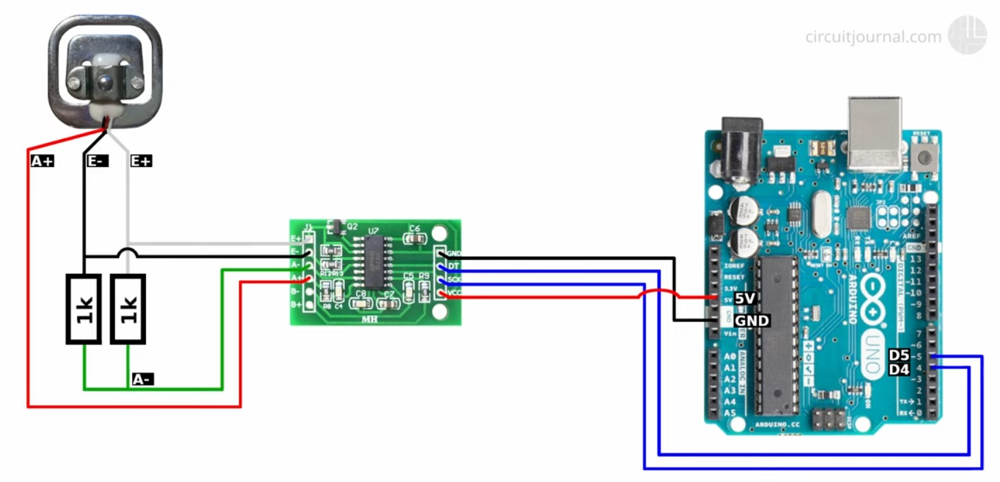

.. post:: 2024-08-19
    :tags: «DiY», Load Cell, HX711, Raspberry PI, FARM-Stack, React, Redux, MongoDB, FastAPI, MongoDB, OpenAPI, WIP
    :language: English

«DiY»  WePosture
################

Good posture through equilibrium. **WIP - Work-In-Progress**

**Let's tinker gadgets**

- Time estimate: One afternoon (net)
- Cost estimate: Far below 50 Euro (Raspberry Pi, Monitor, Keyboard, Mouse not included)
- Skill level: Intermediate hobby tinkerer

.. contents::
    :local:

Background
**********

Recently I met a physician in the field of orthopaedics, sports medicine and performance diagnostics. I learned from him that a good posture is important for our health and well-being. So let's create some thing!

The Gadget
**********

With a ...

- **home-made Balance Board** (like a Wii Balance Board) with hardware used in digital scales, voltage amplifiers (HX711)
- a (little) oversized **microcontroller**, Raspberry PI 5 (RPI5), we can directly work on, so a full-blown computer.
- **WebApp** (Full-Stack with FARM-Stack: FastAPI, React, MongoDB) to visualize the data and to provide a user interface for the user to interact with the gadget. In the DataBase historical health data can be stored and analyzed.

BOM - Bill Of Material
**********************

Production (and Development):

- `1x Raspberry PI 5 (RPI5) <https://www.berrybase.de/raspberry-pi-5-8gb-ram?number=RPI5-8GB&utm_source=google&utm_medium=cpc&gad_source=1&gclid=Cj0KCQjwrKu2BhDkARIsAD7GBov8VedHTQojvFLXx4jcSPB8PM5e2Y9TdrDWQBwLO_QkQxTjDE9FAdEaAlxmEALw_wcB>`__
- 1x SD-Card 32G
- 1x Power adapter 5V, enough current for powering RPI5
- 1x USB-C cable for powering RPI5
- 1x Breadboard 830 points
- `T-Cobbler for RPI <https://www.berrybase.de/t-cobbler-fuer-raspberry-pi-inkl.-gpio-kabel?number=BT-Cobbler&utm_source=google&utm_medium=cpc&gad_source=1&gclid=Cj0KCQjwrKu2BhDkARIsAD7GBotR3UGKdKQ3AWmxZ8MnXMjBl_Sm3wK_7dTaAdycOJBxgVBQf0BfKxAaAlAhEALw_wcB>`__
- Enough Jumper wires male-male
- Enough Jumper wires male-female
- 1x `Ebay: Digital Scale Set (4x Load Cell 50kg each, 1x Amplifier HX711) <https://www.ebay.de/itm/234796576410?_trkparms=amclksrc%3DITM%26aid%3D1110006%26algo%3DHOMESPLICE.SIM%26ao%3D1%26asc%3D20200818143230%26meid%3Db5a09e7cc4f748fc8f013a86210382b7%26pid%3D101224%26rk%3D4%26rkt%3D5%26sd%3D386339206392%26itm%3D234796576410%26pmt%3D1%26noa%3D1%26pg%3D4429486%26algv%3DDefaultOrganicWebV9BertRefreshRankerWithCassiniEmbRecall%26brand%3DMarkenlos&_trksid=p4429486.c101224.m-1>`__
- 3x `Ebay: Amplifier HX711 <https://www.ebay.de/itm/293840537869?_nkw=HX711&itmmeta=01J5MQ8NQHS3Y0ZFJKER1DWYD7&hash=item446a42c90d:g:PgYAAOSwkH5kLTdk&itmprp=enc%3AAQAJAAAA4HoV3kP08IDx%2BKZ9MfhVJKlUkfHyxwr%2BcpjnFHyV18f%2FXZVUImoDurlDUvWO7FGWzAvbALLgRSUeKFzUiAI1BU23DXZelMUpHoeSfk3Jc6RdHAFSf6rsXMGCfvNVir3ITwbpHFq0f4JaV1lmQOztEQfbx6%2B22gKCoyXXevfquYPC4Z5Invd6KXuPmhFXapL84s9R2ub3JXgjbuU1m9GApfa6P6a8gqTIUPOrSPDnNK%2BaF%2Br3cLpOva0R5QmUomA9cDOUuEDB1rq%2FbqetKhF8VQbN%2B5e5s87Ztk5DtmhsX5Z4%7Ctkp%3ABFBM9tuil61k>`__
- 4x `Thingiverse| Half Bridge Load Sensor mount <https://www.thingiverse.com/thing:4873113>`__

Development (in addition):

- 1x `Adapter HDMI-D-plug to HDMI-A-Socket <https://www.berrybase.de/offizielles-raspberry-pi-micro-hdmi-adapterkabel-d-stecker-a-buchse-weiss-235mm?number=RPI4-HDMI6&utm_source=google&utm_medium=cpc&gad_source=1&gclid=Cj0KCQjwrKu2BhDkARIsAD7GBosG7TWPVC6cmPAkKpYrmedKvFhTkG3tQ09WmayeBxPWUaMw9VfZUukaAsViEALw_wcB>`__
- 1x Monitor
- 1x Keyboard
- 1x Mouse

SBOM - Software Bill Of Material
********************************

Production (and Development):

- `Raspberry Pi OS with desktop and recommended software (64-bit) Release date: July 4th 2024, Kernel version 6.6, Debian version: 12 (bookworm) <https://downloads.raspberrypi.com/raspios_full_arm64/images/raspios_full_arm64-2024-07-04/2024-07-04-raspios-bookworm-arm64-full.img.xz?_gl=1*eiaaxh*_ga*MTI2MzMyODY0MC4xNzI0Mzc5MzQy*_ga_22FD70LWDS*MTcyNDY0MzgyNi4xLjAuMTcyNDY0MzgyNi4wLjAuMA..>`__
- Python 3 12.5
- hx711-multi 1.4.1

Development (in addition):

- Visual Studio Code 1.92.2
- pipx 1.1.0
- Poetry 1.8.3

Resources
*********

- `Arduino Scale with HX711 and 50kg Bathroom Scale Load Cells | Step by Step Guide | Connecting one load cell <https://youtu.be/LIuf2egMioA?si=IAhVZdv8fffR8lHE&t=46>`__
- `HX711 class to sample a 24-bit ADC (or multiple) with Python 3 on a Rasperry Pi Zero, 3 or 4 <https://pypi.org/project/hx711-multi/>`__
- `Raspberry Pi Pinout <https://pinout.xyz/>`__
- `PipX statt Pip <https://gnulinux.ch/pipx-statt-pip>`__

Sketches
********

Here some sketches:

.. drawio-figure:: _figures/bd_weposture.drawio

.. figure:: _figures/board_with_feed_and_loadcells.png

Expert Dialogs
**************

Here some GPT-4o chats:

.. toctree::
    :maxdepth: 1
    :caption: Related GPT-4o chats

    _attachments/ChatGPT-ESP32_HX711_Bluetooth_Project.rst
    _attachments/ChatGPT-ESP32_Load_Cell_Integration.rst
    _attachments/ChatGPT-HX711_Circuit_Function.rst
    _attachments/ChatGPT-Using_Wii_BalanceBoard_Raspberry_Pi.rst

Insights in Work-In-Progress
****************************

Hardware (Electronics + Mechanics)
==================================

Prototype Generation One
------------------------

.. figure:: _figures/prototype_1/balance_board.png

    Balance board with top side made of glass waiting and 1k Resistors waiting to get to the four HX711 amplifiers of in the circuit.

UI/UX:

Create image Create a screenshot from a web application created with ant design based on the hand drawing I provided.

You can see the outlines of a left foot and a right foot from top. Each is standing on a plate, illustrated as a rectangle. In the middle there is in black+white the optimal center of gravity of the person who's feet we see projected onto the floor the person is standing. We the actual projected center of gravity as a circle with blue outline and a pie chart in the middle. The left sector of the pie chart is red, the right one is green. In maritime colors the left (larboard, aka port) is red, the right (starboard) is green. We see, in red, another pie chart with a red outline and the same in green, last one on the right. Those are the projected center of gravity of each of the feet. Both feed-center-of-gravities (more exact the projections of them) are combined to the one with the blue outline.

    Sketch on UI/UX

    RPI 4B connected to 2x4 HX711, Power, Monitor, Keyboard and Mouse

    Pinout connections 1 of 2

    Pinout connections 2 of 2

Prototype Generation Two
------------------------

The one-board design from Generation One has changed to a two-board design, each foot gets its own board. The boards are not mechanically connected. The advantage is that they can be adjusted to the foot distance and the orientations to the feed.

I've also thought about a slight modified design which connects the boards mechanically to establish parallel alignment while leaving the distance to the boards variable (within a defined range).

The posture boards' frames are made of wood, the top plates are made of 8mm multiplex board to establish the necessary bending stiffness. The bottom plates are made of 4mm wood plates usually found as rear panels of furniture. The load cells. The top place is pulled to  the bottom by a center screw tightened from the bottom in order to leave the top plate untouched and clean w/o any bores. The tightened center screw creates a preload onto the cells. This preload is zerod out in the initialization phase of the software. While the bottom plates are glued to the frames the top plate floats a little, held and limited by the frame.

One of the boards is extended by the integrated housing of the RaspberryPi. The RaspberyPi has a shield which enables Power-On-LAN (PoL). This reduced the number of cables to be connected to the board. The connection to the other board is made by standard RJ45 cable and suitable sockets. There is no IP network, though. It is the SPI + GPIO + Power connection just realized over those standard cables. This is to keep the design simple and with standardized components.

.. drawio-figure:: _figures/prototype_2/sketch_ui_ux.drawio

    Sketch on UI/UX

    Posture boards assembled

.. figure:: _figures/posture_cable_harness_inkl_pol_injector.png

    Posture cable harness inkl. PoL injector

    Posture kit complete

    Posture boards disassembled

    Setup hardware and software integration testing/tinkering

The demo setup is a simple mug scale. The load cell is mounted on the bottom of the mug. The load cell is connected to the HX711 amplifier. The HX711 is connected to a

    Demo mug scale with one load cell, the HX711 amplifier and a display module

Software
========

Backend
-------

Software (Repository: https://github.com/basejumpa/WeBalance ) already acquires data. Here the continuous output (obsolete, still the output of just 4 load cells connected)::

    --snip--

    read duration: 0.969 seconds, rate: 10.3 Hz
    raw ['1990.750', '-28956.286', '-1740.286', '-17075.444']
    wt ['1990.750', '-28956.286', '-1740.286', '-17075.444']

    read duration: 0.968 seconds, rate: 10.3 Hz
    raw ['1995.625', '-28946.571', '-1719.857', '-17096.286']
    wt ['1995.625', '-28946.571', '-1719.857', '-17096.286']

    read duration: 0.978 seconds, rate: 10.2 Hz
    raw ['1998.714', '-28930.429', '-1654.143', '-17004.875']
    wt ['1998.714', '-28930.429', '-1654.143', '-17004.875']

    --snap--

**Next step:** connect each load cell to its own HX711 as shown here:

    Circuit one cell connected to one hx711. Origin: `Arduino Scale with HX711 and 50kg Bathroom Scale Load Cells | Step by Step Guide | Connecting one load cell <https://youtu.be/LIuf2egMioA?si=IAhVZdv8fffR8lHE&t=46>`__

Realization of REST-API with OpenAPI specificatin using FastAPI.

Constraints: Use Python, use FastAPI. Realize the persistent storage via json files. Expose OpenAPI description.

.. code-block:: python

    from fastapi import FastAPI, HTTPException
    from pydantic import BaseModel
    from typing import Dict
    import json
    import os
    from pathlib import Path
    import uvicorn

    # Import sensor reading logic
    from weposture.__main__ import get_sensor_values

    CONFIG_FILE = Path("config.json")

    def load_config():
        if CONFIG_FILE.exists():
            with open(CONFIG_FILE) as f:
                return json.load(f)
        return {"offsets": {"left": 0.0, "right": 0.0, "center": 0.0}, "k_factors": {"left": 1.0, "right": 1.0, "center": 1.0}}

    def save_config(cfg):
        with open(CONFIG_FILE, 'w') as f:
            json.dump(cfg, f, indent=2)

    app = FastAPI(title="WePosture API", version="1.0")

    config = load_config()

    class SensorValues(BaseModel):
        left: float
        right: float
        center: float

    class Vector(BaseModel):
        x: float
        y: float
        value: float

    class PostureData(BaseModel):
        left: Vector
        right: Vector
        center: Vector

    class CalibrateInput(BaseModel):
        mass_kg: float

    @app.get("/live", response_model=PostureData)
    def get_live_data():
        raw = get_sensor_values()
        try:
            adjusted = {
                k: (raw[k] - config['offsets'][k]) * config['k_factors'][k]
                for k in ['left', 'right', 'center']
            }
            # Placeholder positions based on domain logic
            positions = {
                "left": {"x": -100, "y": -50},
                "right": {"x": 100, "y": -50},
                "center": {"x": 0, "y": 0},
            }
            return PostureData(**{
                k: Vector(x=positions[k]["x"], y=positions[k]["y"], value=adjusted[k])
                for k in adjusted
            })
        except Exception as e:
            raise HTTPException(status_code=500, detail=str(e))

    @app.post("/zero")
    def zero_system():
        raw = get_sensor_values()
        config['offsets'] = raw
        save_config(config)
        return {"status": "ok", "message": "System zeroed"}

    @app.post("/calibrate")
    def calibrate_system(data: CalibrateInput):
        raw = get_sensor_values()
        # Compute average value as sum of all for simplicity (can be refined)
        total_raw = sum(raw.values())
        if total_raw == 0:
            raise HTTPException(status_code=400, detail="Sensor values are all zero, cannot calibrate.")
        for k in raw:
            config['k_factors'][k] = (data.mass_kg * 9.81 * (raw[k] - config['offsets'][k]) / raw[k]) if raw[k] != 0 else 1.0
        save_config(config)
        return {"status": "ok", "message": "Calibration done", "k_factors": config['k_factors']}

    if __name__ == "__main__":
        uvicorn.run("main:app", host="0.0.0.0", port=8000, reload=True)

Frontend
--------

Constraints: JavaScript, React, React-Router, Ant-Design, React-Icons / Ant-Icons, Redux, RTK-Query. if necesarry: React-Three-Fiber, Drei, React-Plotly.

.. code-block::

    import React, { useEffect } from 'react';
    import { BrowserRouter as Router, Route, Routes } from 'react-router-dom';
    import { Button } from 'antd';
    import { useKeyPress } from 'ahooks';
    import { useDispatch } from 'react-redux';
    import { useGetPostureDataQuery, useZeroSystemMutation } from './api/postureApi';
    import './App.css';

    const origin = { x: 0, y: 0 };

    const FloatingCircle = ({ x, y, value, color }) => {
    const style = {
        position: 'absolute',
        left: `calc(50% + ${x}px)`,
        top: `calc(50% - ${y}px)`,
        transform: 'translate(-50%, -50%)',
        borderRadius: '50%',
        border: `2px solid ${color}`,
        padding: '10px',
        background: 'rgba(255,255,255,0.8)',
        fontWeight: 'bold',
    };
    return 
{value}
;
    };

    const LiveView = () => {
    const { data, refetch } = useGetPostureDataQuery();
    const [zeroSystem] = useZeroSystemMutation();

    useKeyPress('space', () => zeroSystem());

    const handleZero = () => {
        zeroSystem();
    };

    return (
        

        

            
            
        

        

        {data && (
            <>
            <FloatingCircle x={data.left.x} y={data.left.y} value={data.left.value} color="red" />
            <FloatingCircle x={data.center.x} y={data.center.y} value={data.center.value} color="blue" />
            <FloatingCircle x={data.right.x} y={data.right.y} value={data.right.value} color="green" />
            </>
        )}

        <Button onClick={handleZero} className="zero-button">Zero</Button>
        

    );
    };

    const App = () => {
    return (
        <Router>
        <Routes>
            <Route path="/" element={<LiveView />} />
        </Routes>
        </Router>
    );
    };

    export default App;

Operating System
----------------

Flash SD-Card with Raspberry Pi OS Lite 64-bit:

.. figure:: _figures/initial_os_settings.png

    Initial OS settings on Raspberry Pi OS Lite 64-bit
