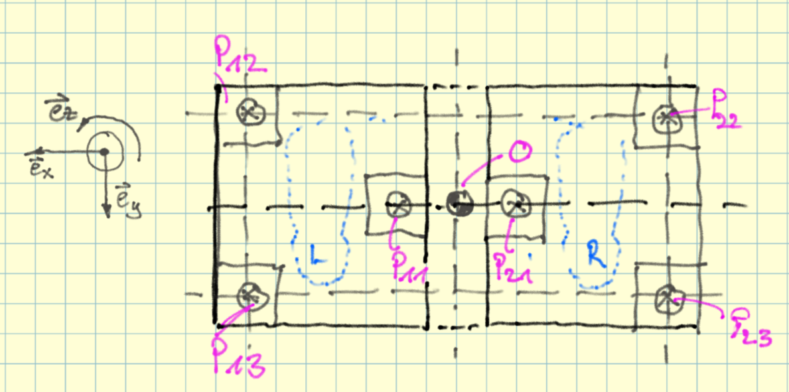
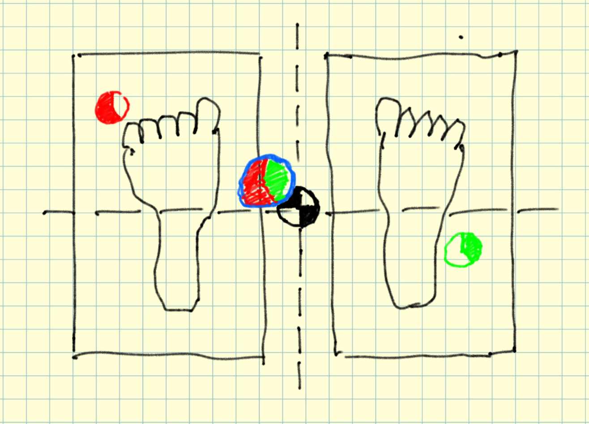
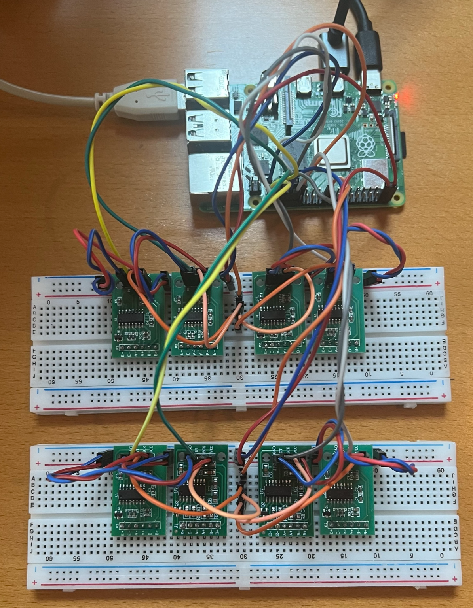
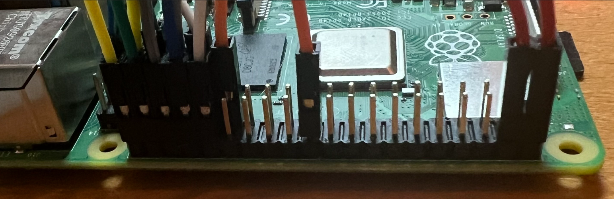
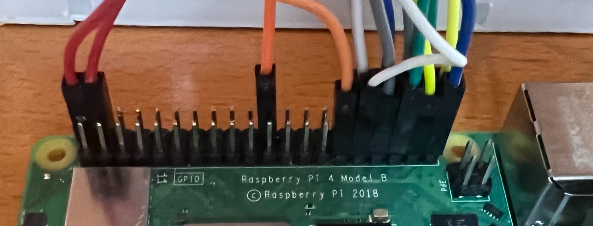
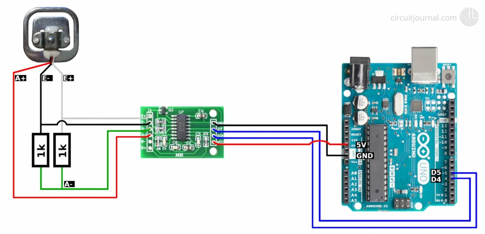
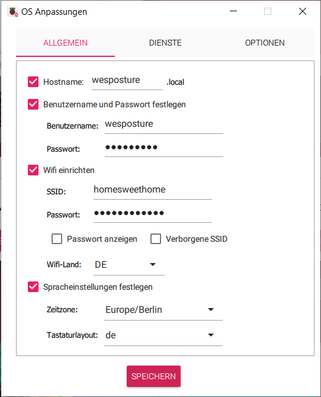

.. post:: 2024-08-19
    :tags: «DiY», Load Cell, HX711, Raspberry PI, FARM-Stack, React, Redux, MongoDB, FastAPI, MongoDB, OpenAPI, WIP
    :language: English

«DiY»  WePosture
################

Good posture through equilibrium. **WIP - Work-In-Progress**

**Let's tinker gadgets**

- Time estimate: One afternoon (net)
- Cost estimate: Far below 50 Euro (Raspberry Pi, Monitor, Keyboard, Mouse not included)
- Skill level: Intermediate hobby tinkerer

Background
**********

Recently I met a physician in the field of orthopaedics, sports medicine and performance diagnostics. I learned from him that a good posture is important for our health and well-being. So let's create some thing!

The Gadget
**********

With a ...

- **home-made Balance Board** (like a Wii Balance Board) with hardware used in digital scales, voltage amplifiers (HX711)
- a (little) oversized **microcontroller**, Raspberry PI 5 (RPI5), we can directly work on, so a full-blown computer.
- **WebApp** (Full-Stack with FARM-Stack: FastAPI, React, MongoDB) to visualize the data and to provide a user interface for the user to interact with the gadget. In the DataBase historical health data can be stored and analyzed.

BOM - Bill Of Material
**********************

Production (and Development):

- `1x Raspberry PI 5 (RPI5) <https://www.berrybase.de/raspberry-pi-5-8gb-ram?number=RPI5-8GB&utm_source=google&utm_medium=cpc&gad_source=1&gclid=Cj0KCQjwrKu2BhDkARIsAD7GBov8VedHTQojvFLXx4jcSPB8PM5e2Y9TdrDWQBwLO_QkQxTjDE9FAdEaAlxmEALw_wcB>`__
- 1x SD-Card 32G
- 1x Power adapter 5V, enough current for powering RPI5
- 1x USB-C cable for powering RPI5
- 1x Breadboard 830 points
- `T-Cobbler for RPI <https://www.berrybase.de/t-cobbler-fuer-raspberry-pi-inkl.-gpio-kabel?number=BT-Cobbler&utm_source=google&utm_medium=cpc&gad_source=1&gclid=Cj0KCQjwrKu2BhDkARIsAD7GBotR3UGKdKQ3AWmxZ8MnXMjBl_Sm3wK_7dTaAdycOJBxgVBQf0BfKxAaAlAhEALw_wcB>`__
- Enough Jumper wires male-male
- Enough Jumper wires male-female
- 1x `Ebay: Digital Scale Set (4x Load Cell 50kg each, 1x Amplifier HX711) <https://www.ebay.de/itm/234796576410?_trkparms=amclksrc%3DITM%26aid%3D1110006%26algo%3DHOMESPLICE.SIM%26ao%3D1%26asc%3D20200818143230%26meid%3Db5a09e7cc4f748fc8f013a86210382b7%26pid%3D101224%26rk%3D4%26rkt%3D5%26sd%3D386339206392%26itm%3D234796576410%26pmt%3D1%26noa%3D1%26pg%3D4429486%26algv%3DDefaultOrganicWebV9BertRefreshRankerWithCassiniEmbRecall%26brand%3DMarkenlos&_trksid=p4429486.c101224.m-1>`__
- 3x `Ebay: Amplifier HX711 <https://www.ebay.de/itm/293840537869?_nkw=HX711&itmmeta=01J5MQ8NQHS3Y0ZFJKER1DWYD7&hash=item446a42c90d:g:PgYAAOSwkH5kLTdk&itmprp=enc%3AAQAJAAAA4HoV3kP08IDx%2BKZ9MfhVJKlUkfHyxwr%2BcpjnFHyV18f%2FXZVUImoDurlDUvWO7FGWzAvbALLgRSUeKFzUiAI1BU23DXZelMUpHoeSfk3Jc6RdHAFSf6rsXMGCfvNVir3ITwbpHFq0f4JaV1lmQOztEQfbx6%2B22gKCoyXXevfquYPC4Z5Invd6KXuPmhFXapL84s9R2ub3JXgjbuU1m9GApfa6P6a8gqTIUPOrSPDnNK%2BaF%2Br3cLpOva0R5QmUomA9cDOUuEDB1rq%2FbqetKhF8VQbN%2B5e5s87Ztk5DtmhsX5Z4%7Ctkp%3ABFBM9tuil61k>`__
- 4x `Thingiverse| Half Bridge Load Sensor mount <https://www.thingiverse.com/thing:4873113>`__

Development (in addition):

- 1x `Adapter HDMI-D-plug to HDMI-A-Socket <https://www.berrybase.de/offizielles-raspberry-pi-micro-hdmi-adapterkabel-d-stecker-a-buchse-weiss-235mm?number=RPI4-HDMI6&utm_source=google&utm_medium=cpc&gad_source=1&gclid=Cj0KCQjwrKu2BhDkARIsAD7GBosG7TWPVC6cmPAkKpYrmedKvFhTkG3tQ09WmayeBxPWUaMw9VfZUukaAsViEALw_wcB>`__
- 1x Monitor
- 1x Keyboard
- 1x Mouse

SBOM - Software Bill Of Material
********************************

Production (and Development):

- `Raspberry Pi OS with desktop and recommended software (64-bit) Release date: July 4th 2024, Kernel version 6.6, Debian version: 12 (bookworm) <https://downloads.raspberrypi.com/raspios_full_arm64/images/raspios_full_arm64-2024-07-04/2024-07-04-raspios-bookworm-arm64-full.img.xz?_gl=1*eiaaxh*_ga*MTI2MzMyODY0MC4xNzI0Mzc5MzQy*_ga_22FD70LWDS*MTcyNDY0MzgyNi4xLjAuMTcyNDY0MzgyNi4wLjAuMA..>`__
- Python 3 12.5
- hx711-multi 1.4.1

Development (in addition):

- Visual Studio Code 1.92.2
- pipx 1.1.0
- Poetry 1.8.3

Resources
*********

- `Arduino Scale with HX711 and 50kg Bathroom Scale Load Cells | Step by Step Guide | Connecting one load cell <https://youtu.be/LIuf2egMioA?si=IAhVZdv8fffR8lHE&t=46>`__
- `HX711 class to sample a 24-bit ADC (or multiple) with Python 3 on a Rasperry Pi Zero, 3 or 4 <https://pypi.org/project/hx711-multi/>`__
- `Raspberry Pi Pinout <https://pinout.xyz/>`__
- `PipX statt Pip <https://gnulinux.ch/pipx-statt-pip>`__

Sketches
********

Here some sketches:

.. drawio-figure:: _figures/bd_weposture.drawio

Expert Dialogs
**************

Here some GPT-4o chats:

.. toctree::
    :maxdepth: 1
    :caption: Related GPT-4o chats

    _attachments/ChatGPT-ESP32_HX711_Bluetooth_Project.rst
    _attachments/ChatGPT-ESP32_Load_Cell_Integration.rst
    _attachments/ChatGPT-HX711_Circuit_Function.rst
    _attachments/ChatGPT-Using_Wii_BalanceBoard_Raspberry_Pi.rst

Insights in Work-In-Progress
****************************

.. figure:: _figures/balance_board.png

    Balance board with top side made of glass waiting and 1k Resistors waiting to get to the four HX711 amplifiers of in the circuit.

    Sketch on UI/UX

    RPI 4B connected to 2x4 HX711, Power, Monitor, Keyboard and Mouse

    Pinout connections 1 of 2

    Pinout connections 2 of 2

Software (Repository: https://github.com/basejumpa/WeBalance ) already acquires data. Here the continuous output (obsolete, still the output of just 4 load cells connected)::

    --snip--

    read duration: 0.969 seconds, rate: 10.3 Hz
    raw ['1990.750', '-28956.286', '-1740.286', '-17075.444']
    wt ['1990.750', '-28956.286', '-1740.286', '-17075.444']

    read duration: 0.968 seconds, rate: 10.3 Hz
    raw ['1995.625', '-28946.571', '-1719.857', '-17096.286']
    wt ['1995.625', '-28946.571', '-1719.857', '-17096.286']

    read duration: 0.978 seconds, rate: 10.2 Hz
    raw ['1998.714', '-28930.429', '-1654.143', '-17004.875']
    wt ['1998.714', '-28930.429', '-1654.143', '-17004.875']

    --snap--

**Next step:** connect each load cell to its own HX711 as shown here:

    Circuit one cell connected to one hx711. Origin: `Arduino Scale with HX711 and 50kg Bathroom Scale Load Cells | Step by Step Guide | Connecting one load cell <https://youtu.be/LIuf2egMioA?si=IAhVZdv8fffR8lHE&t=46>`__

Flash SD-Card with Raspberry Pi OS Lite 64-bit:

    Initial OS settings on Raspberry Pi OS Lite 64-bit
