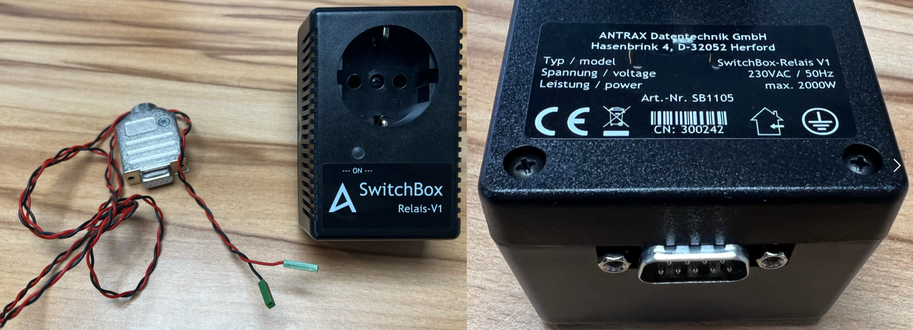
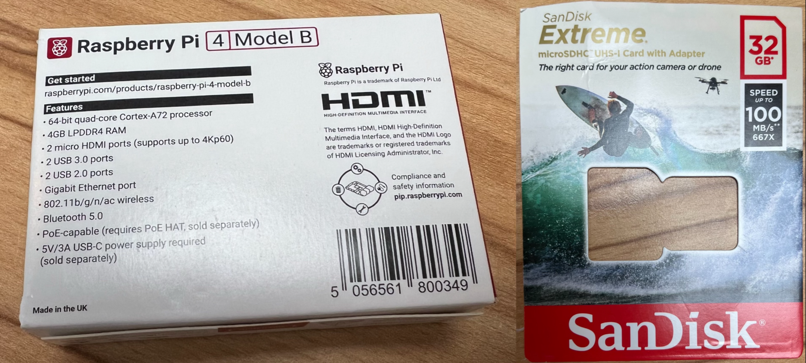
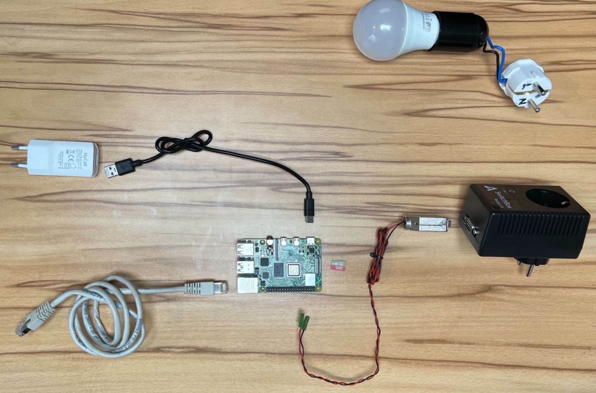
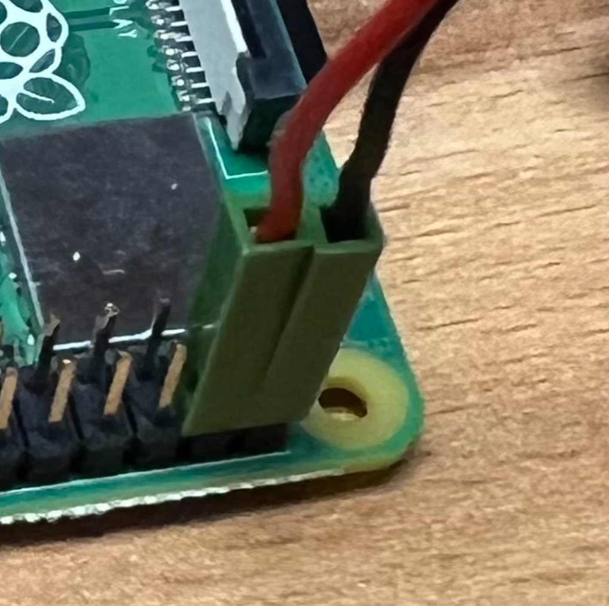
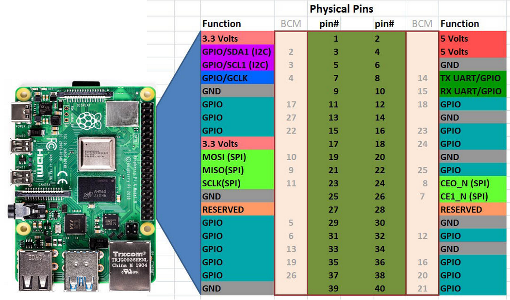

.. post:: 2024-09-01
    :tags: Raspberry Pi, Power Socket, Switch, Remote, minimal, ssh
    :language: English

«DiY»  WeSwitch
###############

Switch Sockets via wired network  **Challenge accepted**

.. contents:: On this page
    :local:
    :depth: 2

The Challenge
*************

Enable switching of a power socket remotely via wired network operated by a tech-savvy user.

Given / provided components:

    SwitchBox with cable and type label

    Raspberry Pi 4B with memory card

I coulnd't find the operation manual online anymore, since I got it in paper form I scanned it: :download:`Operation Manual SwitchBox Relais-V1 <_attachments/ANTRAX_SwitchBox_Relais_V1.pdf>`

Analyze and Create
******************

Elicitate Requirements
======================

- Customer is a friend - no money involved
- Customer is a tech-savvy person in mechanical and electronic matters
- User is a tech-savvy person as well, especially in software.

Identify Design Constraints
===========================

- No Wireless data transfer at all (no WiFi, no Bluetooth, ...)
- Connect the system to the environment via wired network
- Straight-forward to the point of usage by a tech-savvy user

Create the System-Design
========================

    Exploded view of the system with its components and one of the neighbor systems.

.. figure:: _figures/system_assembled_view.png
    :scale: 33%

    Assembled view of the system with its components

    Detailed view on interface between «component» RPI and «component» Relais. Red wire is connected to `BCM pin 26`, black wire is connected to `GND` (ground). See also `Raspberry Pi Pinout <https://pinout.xyz/>`__

.. drawio-figure:: _figures/bd_system_boundaries_with_photo.drawio

    System Boundary Diagram with real components

.. drawio-figure:: _figures/bd_system_and_neighbors.drawio

    System Boundary Diagram with neighbors, their interfaces and logical and technical views

I choose the command line tool `pinctrl <https://github.com/raspberrypi/utils/tree/master/pinctrl>`__ shipped with RPI-OS to be used to control the Relais via the GPIO pins of the RPI. No additional software is needed to be installed on the RPI or developed.

Usage
=====

The `BCM` **pin numbers** are to be used.

.. code-block:: bash
    :linenos:

    some_user@some_host:~$ ssh-copy-id weswitch@weswitch
    --snip--
    some_user@some_host:~$ ssh weswitch@weswitch "pinctrl 26"
    26: op -- pd | hi // GPIO26 = output
    some_user@some_host:~$ ssh weswitch@weswitch "pinctrl 26 dl"
    some_user@some_host:~$ ssh weswitch@weswitch "pinctrl 26"
    26: op -- pd | lo // GPIO26 = output
    some_user@some_host:~$ ssh weswitch@weswitch "pinctrl 26 dh"

Change init behavior
====================

Currently pins `19` and `26` are `ON` after reboot.

This behavior can be changed by modifying the file `/boot/firmware/config.txt`. The keyword `dh` needs to be replaced by `dl`:

.. code-block:: bash
    :linenos:

    some_user@some_host:~$ ssh weswitch@weswitch "sudo sed -i 's/\(gpio=19=op,\)dh/\1dl/' /boot/firmware/config.txt"
    some_user@some_host:~$ ssh weswitch@weswitch "sudo sed -i 's/\(gpio=26=op,\)dh/\1dl/' /boot/firmware/config.txt"
    some_user@some_host:~$ ssh weswitch@weswitch "sudo reboot"

    Pin-out and orientation of 40-pin header of RPI 4B. Source/credits to: https://toptechboy.com/understanding-raspberry-pi-4-gpio-pinouts/

.. toctree::
    :maxdepth: 2

    behind_the_scenes
