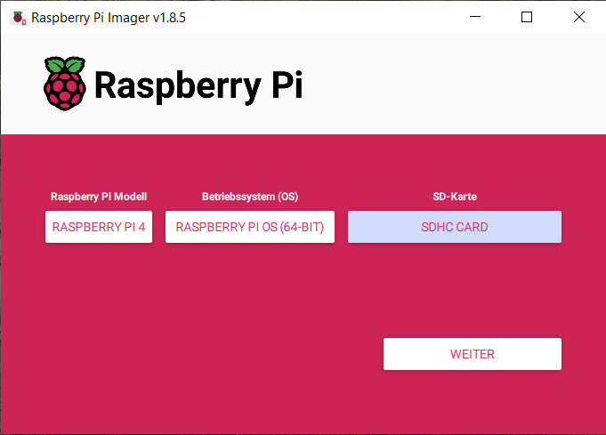
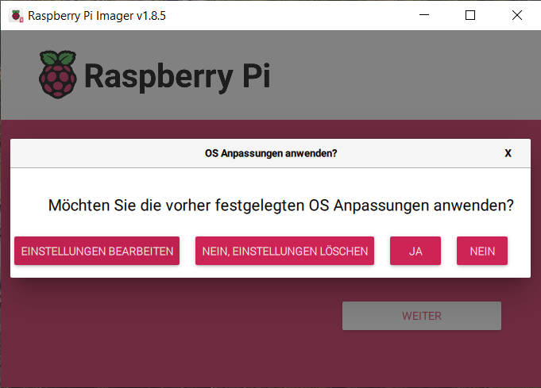
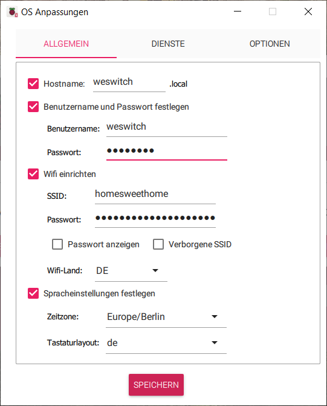
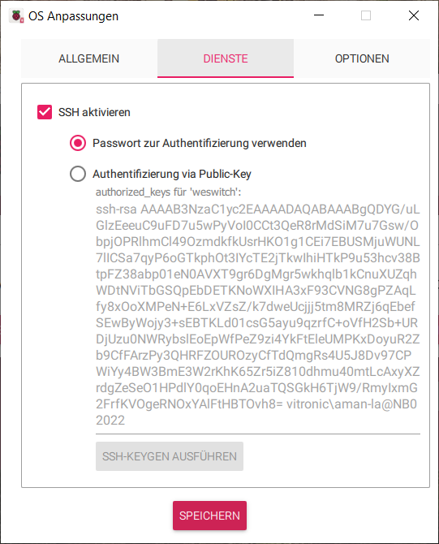
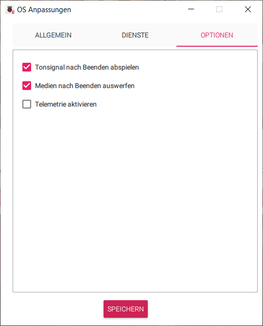
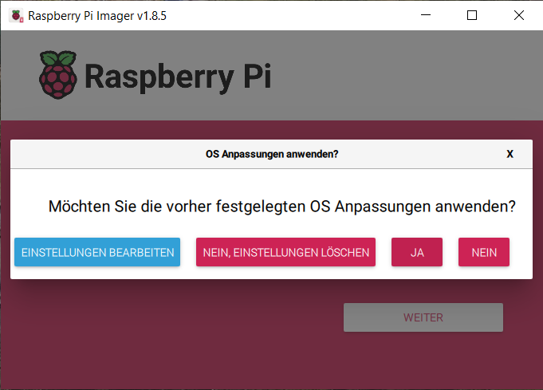
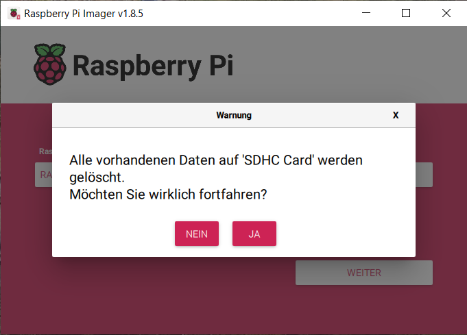
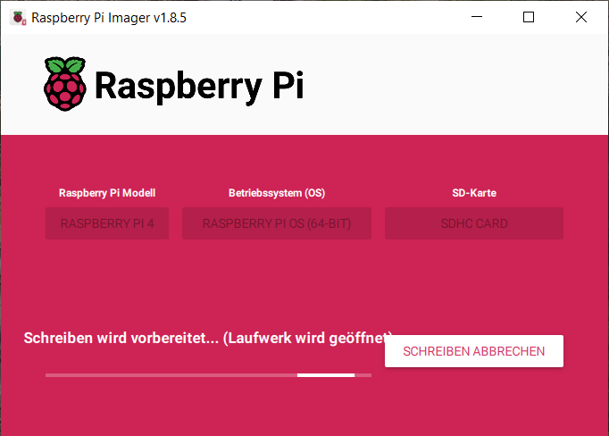
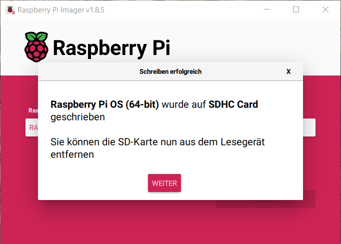

.. post:: 2024-08-30
    :tags: Raspberry Pi, Power Socket, Switch, Remote, minimal, ssh
    :language: English

«DiY»  WeSwitch
###############

Switch Sockets via wired network  **Challenge accepted**

.. contents:: On this page
    :local:
    :depth: 2

Elicitate Requirements
**********************

Identify Design Constraints
***************************

Create Design
**************

Realize
*******

Flash OS Image
==============

`Drink a ☕ with me while waiting ... 😁 <https://www.paypal.com/donate/?hosted_button_id=DDV9AQBFJNMVU>`__

