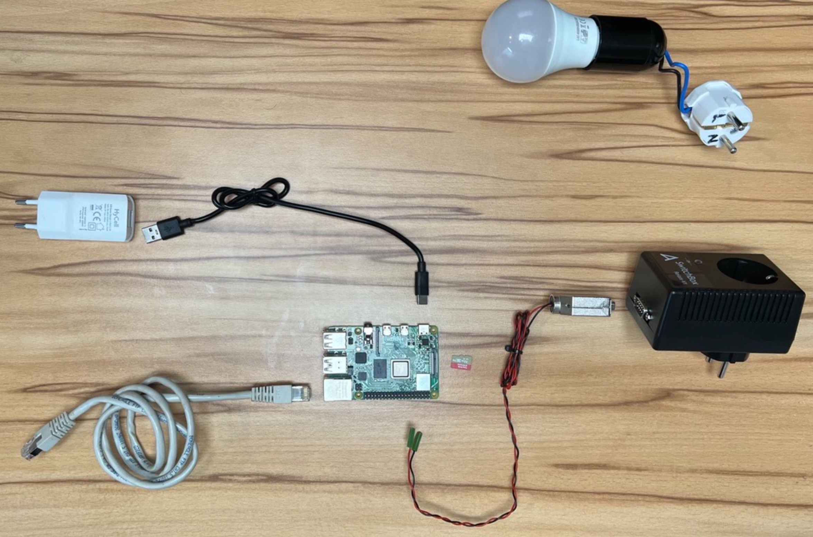
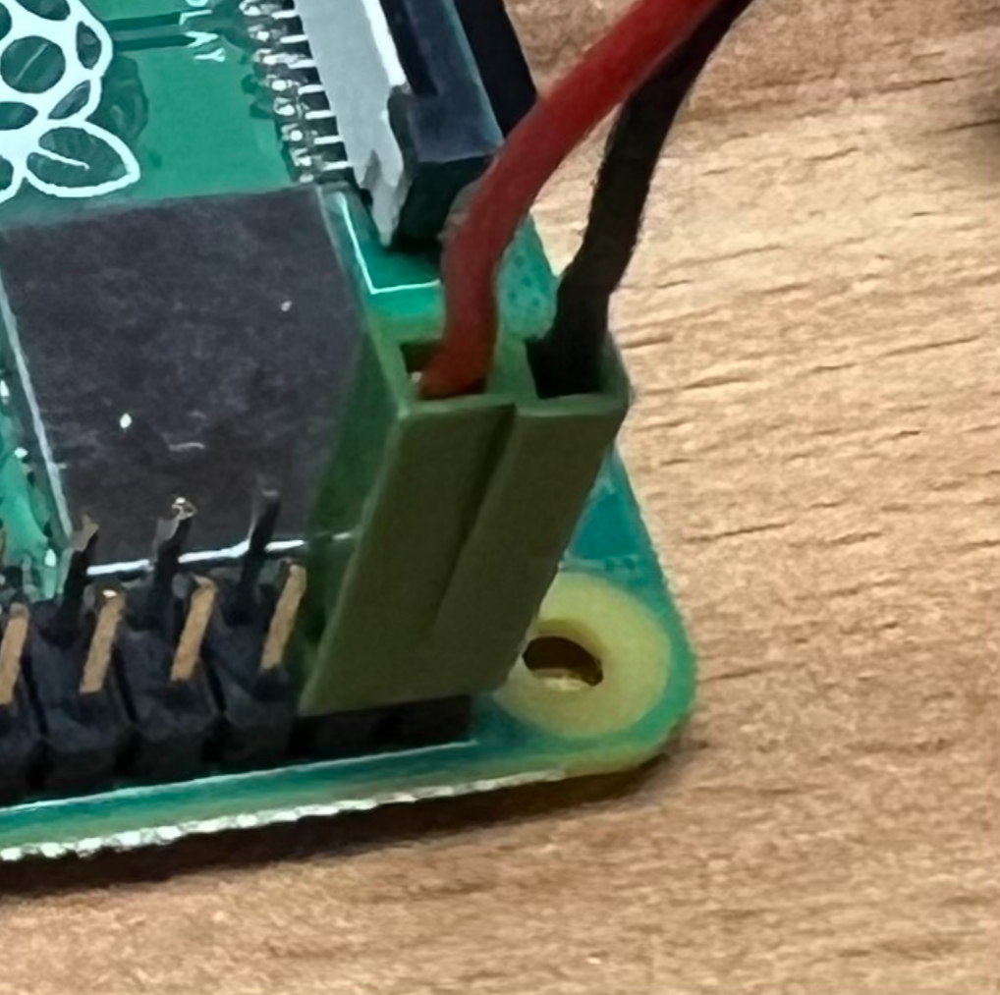
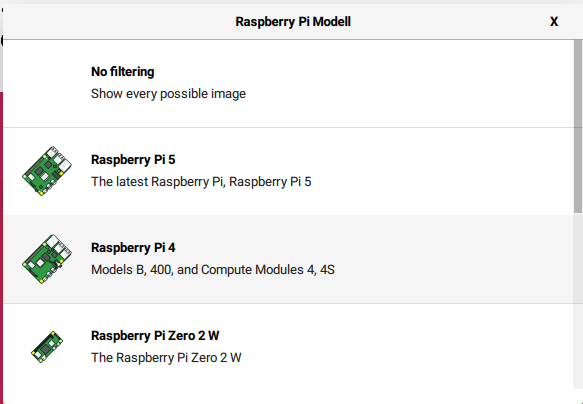
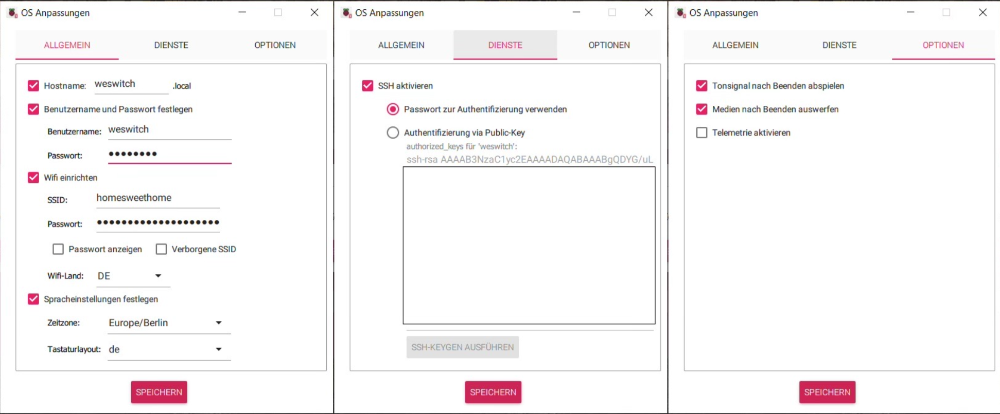
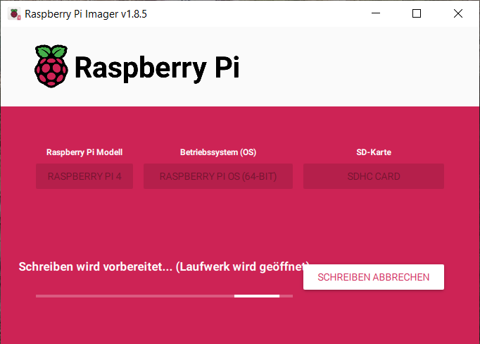

Making Of
#########

Switch Sockets via wired network  **Challenge accepted**

.. contents:: On this page
    :local:
    :depth: 2

Analyze and Create
******************

Elicitate Requirements
======================

- Customer is a friend - no money involved
- Customer is a tech-savvy person in mechanical and electronic matters
- User is a tech-savvy person as well, especially in software.

Identify Design Constraints
===========================

- No Wireless data transfer at all (no WiFi, no Bluetooth, ...)
- Connect the system to the environment via wired network
- Straight-forward to the point of usage by a tech-savvy user

Create the System-Design
========================

    Exploded view of the system with its components and one of the neighbor systems.

.. figure:: _figures/system_assembled_view.png
    :scale: 33%

    Assembled view of the system with its components

    Detailed view on interface between «component» RPI and «component» Relais. Red wire is connected to `BCM pin 26`, black wire is connected to `GND` (ground). See also `Raspberry Pi Pinout <https://pinout.xyz/>`__

.. drawio-figure:: _figures/bd_system_boundaries_with_photo.drawio

    System Boundary Diagram with real components

.. drawio-figure:: _figures/bd_system_and_neighbors.drawio

    System Boundary Diagram with neighbors, their interfaces and logical and technical views

I choose the command line tool `pinctrl <https://github.com/raspberrypi/utils/tree/master/pinctrl>`__ shipped with RPI-OS to be used to control the Relais via the GPIO pins of the RPI. No additional software is needed to be installed on the RPI or developed.

Realize
*******

Flash OS Image
==============

Get the **Raspberry Pi OS Imager** for Windows via `scoop.sh <https://scoop.sh>`__. Use Powershell:

.. code-block:: powershell

    PS C:\> scoop install raspberry-pi-imager
    --snip--
    PS C:\>

Troubleshooting: In case scoop isn't already installed then install it as follows and repeat the above command:

.. code-block:: powershell

    PS C:\> Set-ExecutionPolicy -ExecutionPolicy RemoteSigned -Scope CurrentUser
    PS C:\> Invoke-RestMethod -Uri https://get.scoop.sh | Invoke-Expression
    --snip--
    PS C:\>

Use **Raspberry Pi OS Imager** to burn the image onto the SD-card:

.. figure:: _figures/2024-09-01-10-53-46.png
    :scale: 67%

..
    .. figure:: _figures/2024-09-01-14-30-57.png
        :scale: 67%

.. figure:: _figures/2024-08-30-18-05-39.png
    :scale: 67%

Set GPIO settings after (re-)boot
=================================

This is optional.

As default the GPIOs are `OFF` after reboot. Let's change it as described in the `RPI documentation <https://www.raspberrypi.com/documentation/computers/config_txt.html#gpio>`__:

Directly after flashing open on `config.txt` and append the following to the end of the file::

    ## GPIO settings
    # Set pin 26 (BCM) to output and ON after (re-)boot
    gpio=26=op,dh

    # Set pin 19 (BCM) to output and ON after (re-)boot
    gpio=19=op,dh

    ## EOF

Connect the System to the Environment
=====================================

Install Software
================

Being logged on as user `some_user` on host `some_host` execute the following commands in a `bash` or `git-bash`:

.. code-block:: bash
    :linenos:

    wget https://some_user.github.io/blog/2024-09-WeSwitch/_attachments/switch.py
    ssh-copy-id weswitch@weswitch
    scp switch.py weswitch@weswitch:~/
    ssh weswitch@weswitch "chmod +x switch.py"
    ssh weswitch@weswitch "sudo mv switch.py /usr/local/bin/switch"
    rm switch.py

Use System
==========

Being logged on as «user» `some_user` on «host» `some_host` execute the following commands in a `bash` or `git-bash`:

.. code-block:: bash
    :linenos:

    some_electrical_device=26
    ssh weswitch@weswitch "switch $some_electrical_device"
    ssh weswitch@weswitch "switch $some_electrical_device:1"
    ssh weswitch@weswitch "switch $some_electrical_device:0"

Have a coffee with me
=====================

Let's enjoy our new tool and `drink a ☕ together ... <https://www.paypal.com/donate/?hosted_button_id=DDV9AQBFJNMVU>`__ 😁.

Discarded
*********

The procedure / walk
====================

We need an ssh client. If you're under Linux, you have one. If you're under Windows, you can use `Putty <https://www.putty.org/>`__ or, what I recommend, just use the `git-bash`, its environment has ssh included.

If you don't have git with git-bash, then just install it via `scoop`:

.. code-block:: powershell

    PS C:\> scoop install git
    PS C:\>

Let's enable password-less login via ssh:

.. code-block::
    :linenos:
    :emphasize-lines: 1, 5

    some_user@some_host:~$ ssh-copy-id weswitch@weswitch
    /usr/bin/ssh-copy-id: INFO: Source of key(s) to be installed: "/c/Users/some_user/.ssh/id_rsa.pub"
    /usr/bin/ssh-copy-id: INFO: attempting to log in with the new key(s), to filter out any that are already installed
    /usr/bin/ssh-copy-id: INFO: 1 key(s) remain to be installed -- if you are prompted now it is to install the new keys
    weswitch@weswitch's password:

    Number of key(s) added: 1

    Now try logging into the machine, with:   "ssh 'weswitch@weswitch'"
    and check to make sure that only the key(s) you wanted were added.

    some_user@some_host:~$

Now let's log onto system via `ssh`:

.. code-block:: bash
    :linenos:

    some_user@some_host:~$ ssh weswitch@weswitch
    Linux weswitch 6.6.31+rpt-rpi-v8 #1 SMP PREEMPT Debian 1:6.6.31-1+rpt1 (2024-05-29) aarch64

    The programs included with the Debian GNU/Linux system are free software;
    the exact distribution terms for each program are described in the
    individual files in /usr/share/doc/*/copyright.

    Debian GNU/Linux comes with ABSOLUTELY NO WARRANTY, to the extent
    permitted by applicable law.
    Last login: Sat Aug 31 08:31:12 2024
    weswitch@weswitch:~ $

.. code-block::
    :caption: Raspberry Pi GPIO - BCM Pinout

    +-----+------------+----RPI---+------------+-----+
    | BCM |   Function | Physical | Function   | BCM |
    +-----+------------+----++----+------------+-----+
    |     |       3.3V |  1 || 2  | 5v         |     |
    |  2  |   I2C1 SDA |  3 || 4  | 5v         |     |
    |  3  |   I2C1 SCL |  5 || 6  | GND        |     |
    |  4  |     GPCLK0 |  7 || 8  | UART TX    | 14  |
    |     |        GND |  9 || 10 | UART RX    | 15  |
    | 17  |            | 11 || 12 | PCM CLK    | 18  |
    | 27  |            | 13 || 14 | GND        |     |
    | 22  |            | 15 || 16 |            | 23  |
    |     |       3.3V | 17 || 18 |            | 24  |
    | 10  |  SPI0 MOSI | 19 || 20 | GND        |     |
    |  9  |  SPI0 MISO | 21 || 22 |            | 25  |
    | 11  |  SPI0 SCLK | 23 || 24 | SPI0 CE0   |  8  |
    |     |        GND | 25 || 26 | SPI0 CE1   |  7  |
    |  0  | EEPROM SDA | 27 || 28 | EEPROM SCL |  1  |
    |  5  |            | 29 || 30 | GND        |     |
    |  6  |            | 31 || 32 |            | 12  |
    | 13  |       PWM1 | 33 || 34 | GND        |     |
    | 19  |     PCM FS | 35 || 36 |            | 16  |
    | 26  |            | 37 || 38 | PCM DIN    | 20  |
    |     |        GND | 39 || 40 | PCM DOUT   | 21  |
    +-----+------------+----++----+------------+-----+

.. figure:: _figures/rpi_4b_pinout.png
    :scale: 50%

    Pin-out and orientation of 40-pin header of RPI 4B. Source/credits to: https://toptechboy.com/understanding-raspberry-pi-4-gpio-pinouts/

.. code-block:: bash
    :linenos:
    :emphasize-lines: 1, 3-4, 20, 24

    weswitch@weswitch:~ $ python --version
    Python 3.11.2
    weswitch@weswitch:~ $ python -m pip install gpiozero
    error: externally-managed-environment

    × This environment is externally managed
    ╰─> To install Python packages system-wide, try apt install
        python3-xyz, where xyz is the package you are trying to
        install.

        If you wish to install a non-Debian-packaged Python package,
        create a virtual environment using python3 -m venv path/to/venv.
        Then use path/to/venv/bin/python and path/to/venv/bin/pip. Make
        sure you have python3-full installed.

        For more information visit http://rptl.io/venv

    note: If you believe this is a mistake, please contact your Python installation or OS distribution provider. You can override this, at the risk of breaking your Python installation or OS, by passing --break-system-packages.
    hint: See PEP 668 for the detailed specification.
    weswitch@weswitch:~ $ sudo apt-get install python3-gpiozero
    Reading package lists... Done
    Building dependency tree... Done
    Reading state information... Done
    python3-gpiozero is already the newest version (2.0-1).
    0 upgraded, 0 newly installed, 0 to remove and 92 not upgraded.
    weswitch@weswitch:~ $

The AI-driven development loop:

.. code-block:: bash
    :linenos:
    :emphasize-lines: 3, 6, 11

    weswitch@weswitch:~ $ touch switch.py && chmod +x switch.py

    weswitch@weswitch:~ $ # [A] Talk to the AI to get the code
    weswitch@weswitch:~ $ # Copy the code into the clipboard and transfer it to the RPI
    weswitch@weswitch:~ $ #
    weswitch@weswitch:~ $ cat > switch.py
    # Paste it from the clipboard with Mouse-Right-Click
    # Hit Ctrl-D (EOF) to save the file

    weswitch@weswitch:~ $ # Test the code
    weswitch@weswitch:~ $ ./switch.py
    weswitch@weswitch:~ $ # ...

    weswitch@weswitch:~ $ # Based on the results decide whether it needs rework or it's good to go ([A] or [B])
    weswitch@weswitch:~ $ # [B] Finish

Set up defined GPIO settings after (re-)boot.

As default the GPIOs are OFF after reboot. Let's change it as described in the `RPI documentation <https://www.raspberrypi.com/documentation/computers/config_txt.html#gpio>`__:

.. code-block:: bash
    :linenos:

    weswitch@weswitch:~ $ sudo vi /boot/firmware/config.txt
    weswitch@weswitch:~ $ tail /boot/firmware/config.txt

    ## GPIO settings
    # Set pin 26 (BCM) to output and ON after (re-)boot
    gpio=26=op,dh

    # Set pin 19 (BCM) to output and ON after (re-)boot
    gpio=19=op,dh

    ## EOF

    weswitch@weswitch:~ $

Find through thread of issue `gpiozero#707 <https://github.com/gpiozero/gpiozero/issues/707>`__ more infos about state-of-the-art command line tool for gpio control under RPI: `pinctrl`:

- `RPI documentation / config.txt / gpio <https://www.raspberrypi.com/documentation/computers/config_txt.html#gpio>`__
- `raspi-gpio <https://github.com/RPi-Distro/raspi-gpio/blob/master/README.md>`

.. code-block:: bash
    :linenos:

    weswitch@weswitch:~ $ raspi-gpio --help
    Unknown argument "--help" try "raspi-gpio help"
    weswitch@weswitch:~ $ raspi-gpio help

    WARNING! raspi-gpio set writes directly to the GPIO control registers
    ignoring whatever else may be using them (such as Linux drivers) -
    it is designed as a debug tool, only use it if you know what you
    are doing and at your own risk!

    The raspi-gpio tool is designed to help hack / debug BCM283x GPIO.
    Running raspi-gpio with the help argument prints this help.
    raspi-gpio can get and print the state of a GPIO (or all GPIOs)
    and can be used to set the function, pulls and value of a GPIO.
    raspi-gpio must be run as root.
    Use:
    raspi-gpio [<n>] get [GPIO]
    OR
    raspi-gpio [<n>] set <GPIO> [options]
    OR
    raspi-gpio [<n>] funcs [GPIO]
    OR
    raspi-gpio [<n>] raw

    <n> is an option GPIO chip index (default 0)
    GPIO is a comma-separated list of pin numbers or ranges (without spaces),
    e.g. 4 or 18-21 or 7,9-11
    Note that omitting [GPIO] from raspi-gpio get prints all GPIOs.
    raspi-gpio funcs will dump all the possible GPIO alt funcions in CSV format
    or if [GPIO] is specified the alternate funcs just for that specific GPIO.
    Valid [options] for raspi-gpio set are:
    ip      set GPIO as input
    op      set GPIO as output
    a0-a5   set GPIO to alternate function alt0-alt5
    pu      set GPIO in-pad pull up
    pd      set GPIO in-pad pull down
    pn      set GPIO pull none (no pull)
    dh      set GPIO to drive to high (1) level (only valid if set to be an output)
    dl      set GPIO to drive low (0) level (only valid if set to be an output)
    Examples:
    raspi-gpio get              Prints state of all GPIOs one per line
    raspi-gpio get 20           Prints state of GPIO20
    raspi-gpio get 20,21        Prints state of GPIO20 and GPIO21
    raspi-gpio set 20 a5        Set GPIO20 to ALT5 function (GPCLK0)
    raspi-gpio set 20 pu        Enable GPIO20 ~50k in-pad pull up
    raspi-gpio set 20 pd        Enable GPIO20 ~50k in-pad pull down
    raspi-gpio set 20 op        Set GPIO20 to be an output
    raspi-gpio set 20 dl        Set GPIO20 to output low/zero (must already be set as an output)
    raspi-gpio set 20 ip pd     Set GPIO20 to input with pull down
    raspi-gpio set 35 a0 pu     Set GPIO35 to ALT0 function (SPI_CE1_N) with pull up
    raspi-gpio set 20 op pn dh  Set GPIO20 to ouput with no pull and driving high
    weswitch@weswitch:~ $ raspi-gpio gget 26
    Unknown argument "gget" try "raspi-gpio help"
    weswitch@weswitch:~ $ raspi-gpio get 26
    GPIO 26: level=0 func=INPUT
    [ raspi-gpio is deprecated - try `pinctrl` instead ]
    weswitch@weswitch:~ $ pinctrl --help
    Unknown option '--help' - try "pinctrl help"
    weswitch@weswitch:~ $ pinctrl help

    WARNING! pinctrl set writes directly to the GPIO control registers
    ignoring whatever else may be using them (such as Linux drivers) -
    it is designed as a debug tool, only use it if you know what you
    are doing and at your own risk!

    Running pinctrl with the help argument prints this help.
    pinctrl can get and print the state of a GPIO (or all GPIOs)
    and can be used to set the function, pulls and value of a GPIO.
    pinctrl must be run as root.
    Use:
    pinctrl [-p] [-v] get [GPIO]
    OR
    pinctrl [-p] [-v] [-e] set <GPIO> [options]
    OR
    pinctrl [-p] [-v] poll [GPIO]
    OR
    pinctrl [-p] [-v] funcs [GPIO]
    OR
    pinctrl -c <chip> [funcs] [GPIO]

    GPIO is a comma-separated list of GPIO names, numbers or ranges (without
    spaces), e.g. 4 or 18-21 or BT_ON,9-11

    Note that omitting [GPIO] from "pinctrl get" prints all GPIOs.
    If the -p option is given, GPIO numbers are replaced by pin numbers on the
    40-way header. If the -v option is given, the output is more verbose. Including
    the -e option in a "set" causes pinctrl to echo back the new pin states.
    pinctrl funcs will dump all the possible GPIO alt functions in CSV format
    or if [GPIO] is specified the alternate funcs just for that specific GPIO.
    The -c option allows the alt functions (and only the alt function) for a named
    chip to be displayed, even if that chip is not present in the current system.

    Valid [options] for pinctrl set are:
    ip      set GPIO as input
    op      set GPIO as output
    a1-a7   set GPIO to fsel in the range 1-7
    no      set GPIO to no function (NONE)
    pu      set GPIO in-pad pull up
    pd      set GPIO pin-pad pull down
    pn      set GPIO pull none (no pull)
    dh      set GPIO to drive high (1) level (only valid if set to be an output)
    dl      set GPIO to drive low (0) level (only valid if set to be an output)
    Examples:
    pinctrl get              Prints state of all GPIOs one per line
    pinctrl get 10           Prints state of GPIO10
    pinctrl get 10,11        Prints state of GPIO10 and GPIO11
    pinctrl set 10 a2        Set GPIO10 to fsel 2 function (nand_wen_clk)
    pinctrl -e set 10 pu     Enable GPIO10 ~50k in-pad pull up, echoing the result
    pinctrl set 10 pd        Enable GPIO10 ~50k in-pad pull down
    pinctrl set 10 op        Set GPIO10 to be an output
    pinctrl set 10 dl        Set GPIO10 to output low/zero (must already be set as an output)
    pinctrl set 10 ip pd     Set GPIO10 to input with pull down
    pinctrl set 35 a1 pu     Set GPIO35 to fsel 1 (jtag_2_clk) with pull up
    pinctrl set 20 op pn dh  Set GPIO20 to output with no pull and driving high
    pinctrl -c bcm2835 9-11  Display the alt functions for GPIOs 9-11 on bcm2835
    weswitch@weswitch:~ $ pinctrl get 10
    10: ip    -- | lo // GPIO10 = input
    weswitch@weswitch:~ $ pinctrl get 26
    26: ip    -- | lo // GPIO26 = input
    weswitch@weswitch:~ $ pinctrl set 26 op
    weswitch@weswitch:~ $ pinctrl set 26 dh
    weswitch@weswitch:~ $ pinctrl set 26 dl
    weswitch@weswitch:~ $ pinctrl set 26 dh
    weswitch@weswitch:~ $ pinctrl set 26 dl
    weswitch@weswitch:~ $

.. code-block:: bash

    weswitch@weswitch:~ $ sudo tee -a /boot/firmware/config.txt > /dev/null

    ## GPIO settings
    # Set pin 26 (BCM) to output and ON after (re-)boot
    gpio=26=op,dh

    # Set pin 19 (BCM) to output and ON after (re-)boot
    gpio=19=op,dh

    ## EOF
    weswitch@weswitch:~ $ tail /boot/firmware/config.txt

    ## GPIO settings
    # Set pin 26 (BCM) to output and ON after (re-)boot
    gpio=26=op,dh

    # Set pin 19 (BCM) to output and ON after (re-)boot
    gpio=19=op,dh

    ## EOF
    weswitch@weswitch:~ $ sudo reboot

.. code-block:: bash
    :linenos:

    weswitch@weswitch:~ $ sudo reboot

    Broadcast message from root@weswitch on pts/1 (Sun 2024-09-01 15:10:10 CEST):

    The system will reboot now!

    weswitch@weswitch:~ $ Connection to weswitch closed by remote host.
    Connection to weswitch closed.
    some_user@some_host:~$ ssh weswitch@weswitch "pinctrl set 26 dh"
    some_user@some_host:~$ ssh weswitch@weswitch "pinctrl set 26 dl"
    some_user@some_host:~$ ssh weswitch@weswitch "pinctrl set 26 dh"
    some_user@some_host:~$ ssh weswitch@weswitch "pinctrl help"

    WARNING! pinctrl set writes directly to the GPIO control registers
    ignoring whatever else may be using them (such as Linux drivers) -
    it is designed as a debug tool, only use it if you know what you
    are doing and at your own risk!

    Running pinctrl with the help argument prints this help.
    pinctrl can get and print the state of a GPIO (or all GPIOs)
    and can be used to set the function, pulls and value of a GPIO.
    pinctrl must be run as root.
    Use:
    pinctrl [-p] [-v] get [GPIO]
    OR
    pinctrl [-p] [-v] [-e] set <GPIO> [options]
    OR
    pinctrl [-p] [-v] poll [GPIO]
    OR
    pinctrl [-p] [-v] funcs [GPIO]
    OR
    pinctrl -c <chip> [funcs] [GPIO]

    GPIO is a comma-separated list of GPIO names, numbers or ranges (without
    spaces), e.g. 4 or 18-21 or BT_ON,9-11

    Note that omitting [GPIO] from "pinctrl get" prints all GPIOs.
    If the -p option is given, GPIO numbers are replaced by pin numbers on the
    40-way header. If the -v option is given, the output is more verbose. Including
    the -e option in a "set" causes pinctrl to echo back the new pin states.
    pinctrl funcs will dump all the possible GPIO alt functions in CSV format
    or if [GPIO] is specified the alternate funcs just for that specific GPIO.
    The -c option allows the alt functions (and only the alt function) for a named
    chip to be displayed, even if that chip is not present in the current system.

    Valid [options] for pinctrl set are:
    ip      set GPIO as input
    op      set GPIO as output
    a1-a7   set GPIO to fsel in the range 1-7
    no      set GPIO to no function (NONE)
    pu      set GPIO in-pad pull up
    pd      set GPIO pin-pad pull down
    pn      set GPIO pull none (no pull)
    dh      set GPIO to drive high (1) level (only valid if set to be an output)
    dl      set GPIO to drive low (0) level (only valid if set to be an output)
    Examples:
    pinctrl get              Prints state of all GPIOs one per line
    pinctrl get 10           Prints state of GPIO10
    pinctrl get 10,11        Prints state of GPIO10 and GPIO11
    pinctrl set 10 a2        Set GPIO10 to fsel 2 function (nand_wen_clk)
    pinctrl -e set 10 pu     Enable GPIO10 ~50k in-pad pull up, echoing the result
    pinctrl set 10 pd        Enable GPIO10 ~50k in-pad pull down
    pinctrl set 10 op        Set GPIO10 to be an output
    pinctrl set 10 dl        Set GPIO10 to output low/zero (must already be set as an output)
    pinctrl set 10 ip pd     Set GPIO10 to input with pull down
    pinctrl set 35 a1 pu     Set GPIO35 to fsel 1 (jtag_2_clk) with pull up
    pinctrl set 20 op pn dh  Set GPIO20 to output with no pull and driving high
    pinctrl -c bcm2835 9-11  Display the alt functions for GPIOs 9-11 on bcm2835
    some_user@some_host:~$ ssh weswitch@weswitch "pinctrl 26 dl"
    some_user@some_host:~$ ssh weswitch@weswitch "pinctrl 19 dl"
    some_user@some_host:~$ ssh weswitch@weswitch "sudo init 6"
    some_user@some_host:~$

.. code-block:: bash
    :linenos:

    some_user@some_host:~$ ssh-copy-id weswitch@weswitch
    /usr/bin/ssh-copy-id: INFO: Source of key(s) to be installed: "/c/Users/some_user/.ssh/id_rsa.pub"
    The authenticity of host 'weswitch (192.168.1.110)' can't be established.
    ED25519 key fingerprint is SHA256:TPMVfBCS/noxz4hr1w3rRYpVxk5YKuM418legTAkpjw.
    This key is not known by any other names.
    Are you sure you want to continue connecting (yes/no/[fingerprint])? yes
    /usr/bin/ssh-copy-id: INFO: attempting to log in with the new key(s), to filter out any that are already installed
    /usr/bin/ssh-copy-id: INFO: 1 key(s) remain to be installed -- if you are prompted now it is to install the new keys
    weswitch@weswitch's password:

    Number of key(s) added: 1

    Now try logging into the machine, with:   "ssh 'weswitch@weswitch'"
    and check to make sure that only the key(s) you wanted were added.

    some_user@some_host:~$ ssh weswitch@weswitch "tail /boot/firmware/config.txt"
    [cm4]
    # Enable host mode on the 2711 built-in XHCI USB controller.
    # This line should be removed if the legacy DWC2 controller is required
    # (e.g. for USB device mode) or if USB support is not required.
    otg_mode=1

    [cm5]
    dtoverlay=dwc2,dr_mode=host

    [all]
    some_user@some_host:~$ ssh weswitch@weswitch "sudo tee -a /boot/firmware/config.txt > /dev/null"

    ## GPIO settings
    # Set pin 26 (BCM) to output and ON after (re-)boot
    gpio=26=op,dh

    # Set pin 19 (BCM) to output and ON after (re-)boot
    gpio=19=op,dh

    ## EOF
    weswitch@weswitch:~ $ tail /boot/firmware/config.txt

    ## GPIO settings
    # Set pin 26 (BCM) to output and ON after (re-)boot
    gpio=26=op,dh

    # Set pin 19 (BCM) to output and ON after (re-)boot
    gpio=19=op,dh

    ## EOF
    some_user@some_host:~$ ssh weswitch@weswitch "tail /boot/firmware/config.txt"

    ## GPIO settings
    # Set pin 26 (BCM) to output and ON after (re-)boot
    gpio=26=op,dh

    # Set pin 19 (BCM) to output and ON after (re-)boot
    gpio=19=op,dh

    ## EOF
    some_user@some_host:~$ ssh weswitch@weswitch "sudo reboot"
    some_user@some_host:~$

    some_user@some_host:~$ ssh weswitch@weswitch "pinctrl help"

    WARNING! pinctrl set writes directly to the GPIO control registers
    ignoring whatever else may be using them (such as Linux drivers) -
    it is designed as a debug tool, only use it if you know what you
    are doing and at your own risk!

    Running pinctrl with the help argument prints this help.
    pinctrl can get and print the state of a GPIO (or all GPIOs)
    and can be used to set the function, pulls and value of a GPIO.
    pinctrl must be run as root.
    Use:
    pinctrl [-p] [-v] get [GPIO]
    OR
    pinctrl [-p] [-v] [-e] set <GPIO> [options]
    OR
    pinctrl [-p] [-v] poll [GPIO]
    OR
    pinctrl [-p] [-v] funcs [GPIO]
    OR
    pinctrl -c <chip> [funcs] [GPIO]

    GPIO is a comma-separated list of GPIO names, numbers or ranges (without
    spaces), e.g. 4 or 18-21 or BT_ON,9-11

    Note that omitting [GPIO] from "pinctrl get" prints all GPIOs.
    If the -p option is given, GPIO numbers are replaced by pin numbers on the
    40-way header. If the -v option is given, the output is more verbose. Including
    the -e option in a "set" causes pinctrl to echo back the new pin states.
    pinctrl funcs will dump all the possible GPIO alt functions in CSV format
    or if [GPIO] is specified the alternate funcs just for that specific GPIO.
    The -c option allows the alt functions (and only the alt function) for a named
    chip to be displayed, even if that chip is not present in the current system.

    Valid [options] for pinctrl set are:
    ip      set GPIO as input
    op      set GPIO as output
    a1-a7   set GPIO to fsel in the range 1-7
    no      set GPIO to no function (NONE)
    pu      set GPIO in-pad pull up
    pd      set GPIO pin-pad pull down
    pn      set GPIO pull none (no pull)
    dh      set GPIO to drive high (1) level (only valid if set to be an output)
    dl      set GPIO to drive low (0) level (only valid if set to be an output)
    Examples:
    pinctrl get              Prints state of all GPIOs one per line
    pinctrl get 10           Prints state of GPIO10
    pinctrl get 10,11        Prints state of GPIO10 and GPIO11
    pinctrl set 10 a2        Set GPIO10 to fsel 2 function (nand_wen_clk)
    pinctrl -e set 10 pu     Enable GPIO10 ~50k in-pad pull up, echoing the result
    pinctrl set 10 pd        Enable GPIO10 ~50k in-pad pull down
    pinctrl set 10 op        Set GPIO10 to be an output
    pinctrl set 10 dl        Set GPIO10 to output low/zero (must already be set as an output)
    pinctrl set 10 ip pd     Set GPIO10 to input with pull down
    pinctrl set 35 a1 pu     Set GPIO35 to fsel 1 (jtag_2_clk) with pull up
    pinctrl set 20 op pn dh  Set GPIO20 to output with no pull and driving high
    pinctrl -c bcm2835 9-11  Display the alt functions for GPIOs 9-11 on bcm2835
    some_user@some_host:~$

    some_user@some_host:~$ ssh weswitch@weswitch "pinctrl get 26"
    26: op -- pd | hi // GPIO26 = output
    some_user@some_host:~$ ssh weswitch@weswitch "pinctrl get 19"
    19: op -- pd | hi // GPIO19 = output
    some_user@some_host:~$ ssh weswitch@weswitch "pinctrl set 26 dl"
    some_user@some_host:~$ ssh weswitch@weswitch "pinctrl get 26"
    26: op -- pd | lo // GPIO26 = output
    some_user@some_host:~$ ssh weswitch@weswitch "pinctrl set 19 dl"
    some_user@some_host:~$ ssh weswitch@weswitch "pinctrl get 19"
    19: op -- pd | lo // GPIO19 = output
    some_user@some_host:~$ ssh weswitch@weswitch "pinctrl set 26 dh ; pinctrl 19 dh"
    some_user@some_host:~$

    some_user@some_host:~$ ssh weswitch@weswitch "sudo shutdown now"
    System is going down. Unprivileged users are not permitted to log in anymore. For technical details, see pam_nologin(8).

    Connection closed by 192.168.1.110 port 22
    some_user@some_host:~$

.. code-block:: bash
    :linenos:

    some_user@some_host:~$ ssh weswitch@weswitch "pinctrl 19 ; pinctrl 26"
    19: op -- pd | hi // GPIO19 = output
    26: op -- pd | hi // GPIO26 = output
    some_user@some_host:~$ ssh weswitch@weswitch "pinctrl 19 dl ; pinctrl 26 dl"
    some_user@some_host:~$ ssh weswitch@weswitch "pinctrl 19 ; pinctrl 26"
    19: op -- pd | lo // GPIO19 = output
    26: op -- pd | lo // GPIO26 = output
    some_user@some_host:~$ ssh weswitch@weswitch "pinctrl 19 dh ; pinctrl 26 dh"
    some_user@some_host:~$ ssh weswitch@weswitch "pinctrl 19 ; pinctrl 26"
    19: op -- pd | hi // GPIO19 = output
    26: op -- pd | hi // GPIO26 = output
    some_user@some_host:~$

.. code-block:: bash
    :linenos:

    some_user@some_host:~$ ssh-copy-id weswitch@weswitch
    --snip--
    some_user@some_host:~$ ssh weswitch@weswitch "pinctrl 26"
    26: op -- pd | hi // GPIO26 = output
    some_user@some_host:~$ ssh weswitch@weswitch "pinctrl 26 dl"
    some_user@some_host:~$ ssh weswitch@weswitch "pinctrl 26"
    26: op -- pd | lo // GPIO26 = output
    some_user@some_host:~$ ssh weswitch@weswitch "pinctrl 26 dh"

Results
=======

As downloads
------------

- :download:`README.md <_attachments/README.md>`
- :download:`switch.py <_attachments/switch.py>`

Inlined here
------------

.. literalinclude:: _attachments/switch.py
    :language: python
    :linenos:
    :caption: Resulting `switch.py`

.. literalinclude:: _attachments/README.md
    :language: markdown
    :caption: Resulting `README.md`

Resources used
==============

- `Raspberry Pi GPIO Python Guide <https://www.youtube.com/watch?v=n5t8brVw4kQ>`__
- `gpiozero <https://gpiozero.readthedocs.io>`__  - A simple interface to GPIO devices with Raspberry Pi
- Thread "Using gpiozero on RPI to control pins, but output pins are reset upon script exit, even though state is remembered between runs" at `Stack Overflow <https://stackoverflow.com/questions/53618198/using-gpiozero-on-raspberry-pi-to-control-pins-but-output-pins-are-reset-up>`__.
-  `gpiozero#707 <https://github.com/gpiozero/gpiozero/issues/707>`__ - Issue "Allow users to disable implicit cleanup"
- `raspberrypi/utils <https://github.com/raspberrypi/utils>`__ - A collection of scripts and simple applications
- Setting up Wi-Fi on the Raspberry Pi with `nmtui <https://pimylifeup.com/setting-up-raspberry-pi-wifi/>`__

Bycatches
=========

- `Welcome to Phazer Tech <https://phazertech.com/>`__
- `Build Physical Projects With Python on the Raspberry Pi <https://realpython.com/python-raspberry-pi/>`__
- `Raspberry Pi Documentation <https://www.raspberrypi.com/documentation/>`__
